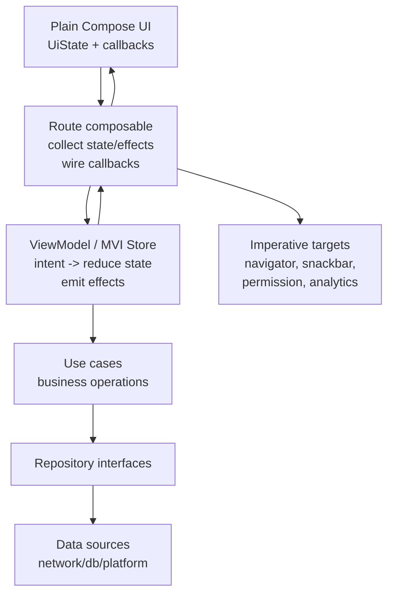
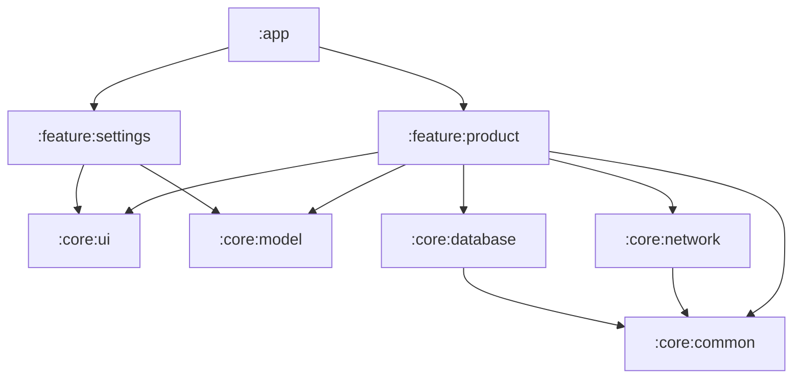

# Android Compose Clean MVI Architecture 深度解析

对应 skill: [`android-compose-clean-mvi-architecture`](../skills/android-compose-clean-mvi-architecture/SKILL.md)

这个 skill 是整个 Android/Compose 知识体系的架构入口。它不是替代前面的 Compose、Flow、协程、测试 skills，而是把它们串成一个 feature-level 的工程判断框架。

核心问题是：

> 一个 Android Compose Feature 应该如何组织 UI、状态、Intent、Effect、UseCase、Repository 和测试边界，才能同时满足 Clean Architecture、MVI 和 Compose runtime 的约束？

## 核心原则

Feature 应该是单向数据流：

```text
Plain Compose UI
  -> emits user intent
Route / state-holder composable
  -> wires callbacks and collects state/effects
ViewModel / MVI Store
  -> handles intents, calls use cases, reduces state, emits effects
Use cases
  -> own business operations
Repositories / data sources
  -> expose suspend and Flow APIs
```

这个原则背后有几条硬边界：

- UI 只渲染状态，并发出用户意图。
- ViewModel / Store 生产 screen UI state。
- UseCase 承载业务操作。
- Repository / DataSource 暴露 `suspend` / `Flow`，不偷持 UI 生命周期。
- 一次性事件用 Effect 明确建模，不塞进 render state。
- Compose runtime 对象留在 composition，不进 ViewModel。

## Clean Architecture 不是文件夹结构

Clean Architecture 的重点不是：

```text
data/
domain/
presentation/
```

而是依赖方向和职责边界。

真正重要的是：

- Domain 不知道 Android UI。
- UseCase 不知道 Compose。
- Repository interface 不关心 ViewModel。
- Data implementation 不影响 UI state shape。
- Presentation 不直接依赖 DTO/entity。
- UI 不直接调用 repository。

一个项目可以有标准目录结构，但边界仍然错；也可以目录简单，但依赖方向正确。

## MVI 不是巨大 reducer

MVI 的价值是：

- 输入统一：Intent。
- 输出明确：UiState + Effect。
- 状态变化可追踪。
- UI 是状态函数。

但它不意味着：

- 所有东西都必须塞进一个 reducer。
- reducer 可以做网络请求。
- 所有 screen 都必须有 sealed Intent。
- 所有 UI-local state 都必须进 ViewModel。

Reducer 应该是纯、快、可重试的状态变换。Suspend work 和 business rules 应该分别在 ViewModel coroutine 与 UseCase 中完成。

## 推荐分层



### Plain Compose UI

职责：

- 接收 immutable `UiState`。
- 接收 callbacks 或 `onIntent`。
- 渲染 layout。
- 管 modifier、semantics、test tags。
- 管 UI-local state，例如 scroll、focus、animation、interaction。

不应该：

- 接收 ViewModel / Component。
- 直接 collect business Flow。
- 直接调用 repository / use case。
- 直接导航。
- 持有业务规则。

### Route / state-holder composable

职责：

- `collectAsStateWithLifecycle()` 收集 render state。
- `LaunchedEffect` 收集 Effect stream。
- 连接 navigator、snackbar、permission launcher、analytics。
- 把 ViewModel 方法映射成 UI callback。

不应该：

- 承担大段 layout。
- 写业务规则。
- 把 ViewModel 继续传给 child。

### ViewModel / MVI Store

职责：

- 持有 `StateFlow<UiState>`。
- 接收 `Intent`。
- 调用 UseCase。
- 用 `MutableStateFlow.update {}` reduce state。
- 发出一次性 `Effect`。
- 用 `viewModelScope` 承接 UI event 到 suspend work 的边界。

不应该：

- 持有 `LazyListState`、`FocusRequester`、`SnackbarHostState`、`PagerState`、`DrawerState`。
- 直接操作 Compose UI runtime。
- 暴露 mutable state 给 UI。
- 把 navigation flag 放进 `UiState`。

### UseCase / Domain

职责：

- 业务规则。
- suspend operation。
- domain model。
- repository interface 调用。

不应该：

- 依赖 Compose。
- 依赖 Android View。
- 触发 snackbar/navigation。
- 持有 UI state。

### Repository / Data

职责：

- 网络、数据库、缓存。
- DTO/entity mapping。
- 实现 repository interface。
- 暴露 `suspend` / `Flow`。

不应该：

- 存 `CoroutineScope` 然后 fire-and-forget。
- 在 `init` launch。
- 泄漏 DTO 到复杂 UI。
- 用 fake sentinel 污染 domain `StateFlow`。

## 目录设计

目录结构应该服务于边界，而不是反过来让文件夹决定架构。推荐优先使用 **feature-first + layer-inside-feature**，尤其适合中大型 Android Compose 项目：

```text
app/
  src/main/java/com/example/app/
    App.kt
    MainActivity.kt
    navigation/
      AppNavHost.kt
      AppDestination.kt
    di/
      AppModule.kt

core/
  common/
    src/main/java/com/example/core/common/
      dispatcher/
      result/
      time/
  model/
    src/main/java/com/example/core/model/
      UserId.kt
      ProductId.kt
  network/
    src/main/java/com/example/core/network/
      api/
      dto/
  database/
    src/main/java/com/example/core/database/
      dao/
      entity/
  ui/
    src/main/java/com/example/core/ui/
      component/
      theme/
      preview/

feature/
  product/
    src/main/java/com/example/feature/product/
      ProductRoute.kt
      ProductScreen.kt
      ProductViewModel.kt
      ProductContract.kt
      ProductUiMapper.kt
      ProductNavigator.kt
      component/
        ProductList.kt
        ProductCard.kt
      state/
        ProductListState.kt
      domain/
        LoadProducts.kt
        ObserveProducts.kt
        ProductRepository.kt
      data/
        DefaultProductRepository.kt
        ProductRemoteDataSource.kt
        ProductLocalDataSource.kt
        ProductDtoMapper.kt
        ProductEntityMapper.kt
```

这只是一个推荐形状，不是必须照抄。关键判断是：

- feature 内部能独立表达自己的 UI、状态、use case 和 repository contract。
- core 只放跨 feature 复用的基础能力。
- app 只做应用装配：Activity、NavHost、DI root、全局主题入口。
- data implementation 可以在 feature 内，也可以下沉到独立 data module，取决于复用范围。

### 为什么推荐 feature-first

纯 layer-first 目录常见形态：

```text
presentation/
  product/
domain/
  product/
data/
  product/
```

这种结构在小项目中可行，但 feature 增多后会出现几个问题：

- 修改一个 feature 要跨多个顶层目录跳转。
- feature ownership 不清晰。
- 删除/迁移 feature 成本高。
- review 时很难一眼看到这个 feature 的完整边界。

feature-first 更贴近产品边界：

```text
feature/product/
  presentation files
  domain use cases
  repository contract
  data implementation when feature-owned
```

它不是反 Clean Architecture。Clean Architecture 要求的是依赖方向，不要求所有 domain 文件必须在一个顶层 `domain/` 目录里。

## Feature 目录详解

以 `feature/product` 为例：

```text
feature/product/
  ProductRoute.kt
  ProductScreen.kt
  ProductViewModel.kt
  ProductContract.kt
  ProductUiMapper.kt
  ProductNavigator.kt
  component/
  state/
  domain/
  data/
```

### `ProductContract.kt`

放 presentation contract：

```kotlin
data class ProductUiState(...)

sealed interface ProductIntent { ... }

sealed interface ProductEffect { ... }

data class ProductUi(...)
```

也可以拆成多个文件：

```text
ProductUiState.kt
ProductIntent.kt
ProductEffect.kt
ProductUi.kt
```

选择标准：

- contract 很小：放一个文件。
- state/effect/ui model 很大：拆文件。
- 不要为了“统一模板”把三行 sealed interface 单独拆成很多文件。

### `ProductRoute.kt`

放 state-holder composable：

```kotlin
@Composable
fun ProductRoute(
    viewModel: ProductViewModel,
    navigator: ProductNavigator,
    snackbarHostState: SnackbarHostState,
) {
    val state by viewModel.state.collectAsStateWithLifecycle()

    LaunchedEffect(viewModel.effects) {
        viewModel.effects.collect { effect ->
            // handle navigation/snackbar/etc.
        }
    }

    ProductScreen(
        state = state,
        onIntent = viewModel::accept,
    )
}
```

这里可以知道 ViewModel、Navigator、SnackbarHostState、permission launcher、activity result launcher。

不放大段 layout。

### `ProductScreen.kt`

放 plain UI composable：

```kotlin
@Composable
fun ProductScreen(
    state: ProductUiState,
    onIntent: (ProductIntent) -> Unit,
    modifier: Modifier = Modifier,
) {
    // layout only
}
```

它不接收 ViewModel、Repository、UseCase、Navigator。

对于复杂 screen，可以继续拆私有或 package-private content：

```text
component/ProductList.kt
component/ProductCard.kt
component/ProductErrorState.kt
component/ProductLoadingState.kt
```

### `ProductViewModel.kt`

放 screen state holder：

```kotlin
class ProductViewModel(
    private val loadProducts: LoadProducts,
) : ViewModel() {
    val state: StateFlow<ProductUiState>
    val effects: Flow<ProductEffect>
    fun accept(intent: ProductIntent)
}
```

它可以：

- `viewModelScope.launch` 处理 UI event。
- 调用 use case。
- `MutableStateFlow.update {}` reduce state。
- `Channel(BUFFERED)` 发 effect。

它不应该：

- 持有 `LazyListState`。
- 持有 `FocusRequester`。
- 持有 `SnackbarHostState`。
- 暴露 `MutableStateFlow`。
- 直接依赖 Retrofit DTO / Room Entity。

### `ProductUiMapper.kt`

放 domain -> UI model mapping：

```kotlin
fun Product.toUi(): ProductUi = ProductUi(
    id = id,
    title = title,
    priceText = price.formatForDisplay(),
    canBuy = availability.canBuy,
)
```

UI mapper 属于 presentation，因为它产生的是 UI 展示形状。

不要把 UI 文案、enabled 状态、display formatting 散落在 composable 里。

### `ProductNavigator.kt`

可选。用于隔离 navigation policy：

```kotlin
interface ProductNavigator {
    fun back()
    fun openProduct(id: ProductId)
}
```

如果项目已有统一 navigator，可以不用 feature navigator。原则是：plain UI 不知道 route string，Route 层负责把 Effect 或 callback 接到 navigation。

### `component/`

放 feature-private UI 组件：

```text
component/
  ProductList.kt
  ProductCard.kt
  ProductEmptyState.kt
  ProductErrorState.kt
```

这些组件通常：

- 接收 plain values 和 callbacks。
- 有 `modifier: Modifier = Modifier`。
- 不接收 ViewModel。
- 不调用 use case。

如果组件变成跨 feature 复用，再考虑移动到 `core/ui/component/`。

### `state/`

放 composition-owned plain state holder：

```text
state/
  ProductListState.kt
  ProductSearchState.kt
```

例如：

```kotlin
@Stable
class ProductSearchState(
    private val listState: LazyListState,
    private val focusRequester: FocusRequester,
) {
    var query by mutableStateOf("")
        private set

    fun clear() {
        query = ""
        focusRequester.requestFocus()
    }
}
```

这类 state holder 管 UI 机制，不管业务数据生产。它通常由 `rememberProductSearchState()` 创建，生命周期跟 composition 绑定。

### `domain/`

放 feature-owned use cases、repository contract、domain-specific model：

```text
domain/
  LoadProducts.kt
  ObserveProducts.kt
  ProductRepository.kt
```

UseCase 示例：

```kotlin
class LoadProducts(
    private val repository: ProductRepository,
) {
    suspend operator fun invoke(): List<Product> {
        return repository.loadProducts()
    }
}
```

Repository contract：

```kotlin
interface ProductRepository {
    suspend fun loadProducts(): List<Product>
    fun observeProducts(): Flow<List<Product>>
}
```

如果 domain model 被多个 feature 共享，放到 `core/model` 或专门的 domain module。不要为了“复用可能性”过早移动。

### `data/`

放 feature-owned repository implementation 和 data source：

```text
data/
  DefaultProductRepository.kt
  ProductRemoteDataSource.kt
  ProductLocalDataSource.kt
  ProductDtoMapper.kt
  ProductEntityMapper.kt
```

Data 层可以依赖 network/database module：

```kotlin
class DefaultProductRepository(
    private val remote: ProductRemoteDataSource,
    private val local: ProductLocalDataSource,
) : ProductRepository
```

规则：

- DTO 不跨到 presentation。
- Entity 不跨到 presentation。
- Repository implementation 不持有 UI scope。
- Data mapper 不处理 Compose UI 文案。

## 多模块依赖方向

如果项目采用 Gradle 多模块，可以这样组织：

```text
:app
:core:common
:core:model
:core:network
:core:database
:core:ui
:feature:product
:feature:settings
```

推荐依赖方向：



更严格的项目会继续拆：

```text
:feature:product:api
:feature:product:impl
:domain:product
:data:product
```

但不要默认上来就拆这么细。模块拆分会增加 Gradle、DI、navigation、visibility 管理成本。只有当以下问题真实存在时再拆：

- feature 需要独立交付。
- 多团队并行开发边界明显。
- build time 需要更细粒度隔离。
- API/implementation visibility 很重要。
- domain/data 被多个 app 或 feature 复用。

## 包命名建议

保持 package 反映 ownership：

```text
com.example.feature.product
com.example.feature.product.component
com.example.feature.product.state
com.example.feature.product.domain
com.example.feature.product.data
com.example.core.ui
com.example.core.model
```

避免：

```text
com.example.presentation
com.example.domain
com.example.data
```

在大型项目中，过宽的 layer package 会让 feature ownership 变弱。

## 文件命名建议

| 文件 | 内容 |
|---|---|
| `XxxRoute.kt` | state/effect collection、navigation/snackbar wiring |
| `XxxScreen.kt` | public plain UI composable |
| `XxxContent.kt` | private/package UI layout 拆分，按需要使用 |
| `XxxViewModel.kt` | screen state holder |
| `XxxContract.kt` | `UiState` / `Intent` / `Effect` / UI model |
| `XxxUiMapper.kt` | domain -> UI mapping |
| `XxxRepository.kt` | domain repository interface |
| `DefaultXxxRepository.kt` | data repository implementation |
| `XxxRemoteDataSource.kt` | network source |
| `XxxLocalDataSource.kt` | database/cache source |

不要为了模板机械创建空文件。目录和文件应该随复杂度增长。

## 测试目录

建议按 contract 放测试：

```text
feature/product/src/test/
  ProductViewModelTest.kt
  LoadProductsTest.kt
  DefaultProductRepositoryTest.kt
  ProductUiMapperTest.kt

feature/product/src/androidTest/
  ProductScreenTest.kt
  ProductRouteSmokeTest.kt

feature/product/src/screenshotTest/
  ProductScreenScreenshotTest.kt
```

测试策略：

- UI branch：测 `ProductScreen`，传 fake `UiState`。
- Intent handling：测 `ProductViewModel.accept(...)`。
- Effect：collect `effects`。
- UseCase：普通 unit test。
- Repository：fake remote/local source。
- Route：只做少量 smoke，不测所有 UI 分支。

## 目录设计审查清单

1. 一个 feature 的 UI、state holder、use case、repository contract 是否能在同一 feature 边界内看到？
2. `app` 是否只做装配，而不是写业务规则？
3. `core` 是否只放真实跨 feature 复用能力？
4. DTO/entity 是否被限制在 data/network/database 边界？
5. UI model mapping 是否在 presentation，而不是 composable 内散落？
6. Compose runtime object 是否只在 UI 或 plain state holder 中出现？
7. Repository interface 和 implementation 是否方向清晰？
8. 模块拆分是否解决真实问题，而不是为了形式上的 Clean Architecture？

## 三件套：UiState / Intent / Effect

### UiState

`UiState` 是 durable render state。

```kotlin
data class ProductUiState(
    val isLoading: Boolean,
    val products: ImmutableList<ProductUi>,
    val errorMessage: String?,
    val canRetry: Boolean,
)
```

原则：

- immutable。
- Compose stability-friendly。
- collection 优先 immutable collection。
- 不放 callback。
- 不放 service/repository。
- 不放 Compose runtime object。

### Intent

Intent 表达用户或 lifecycle 输入。

```kotlin
sealed interface ProductIntent {
    data object RetryClicked : ProductIntent
    data object BackClicked : ProductIntent
    data class ProductClicked(val id: ProductId) : ProductIntent
}
```

Intent 应该描述用户做了什么，而不是命令内部状态怎么改。

不推荐：

```kotlin
data class SetLoading(val value: Boolean)
data class NavigateTo(val route: String)
```

### Effect

Effect 表达一次性 imperative output。

```kotlin
sealed interface ProductEffect {
    data object Back : ProductEffect
    data class OpenProduct(val id: ProductId) : ProductEffect
    data class ShowMessage(val message: String) : ProductEffect
}
```

不要把 effect 塞进 `UiState`：

```kotlin
data class UiState(
    val shouldNavigateBack: Boolean = false,
    val snackbarMessage: String? = null,
)
```

这种写法需要 reset，容易重复消费，也不清楚配置变化后的语义。

## Effect stream 选择

对于单个 UI consumer 的 navigation/snackbar：

```kotlin
private val _effects = Channel<ProductEffect>(Channel.BUFFERED)
val effects: Flow<ProductEffect> = _effects.receiveAsFlow()
```

注意：

- `receiveAsFlow()` 是 fan-out，不是 broadcast。
- 多 collector 时，每个 event 只会交给一个 collector。
- 如果多个观察者都必须收到 event，需要 durable state 或有意配置的 broadcast stream。

不要无脑使用：

```kotlin
MutableSharedFlow<ProductEffect>()
```

默认没有 replay，没 collector 时 emission 会丢。

## ViewModel 中的 coroutine 边界

ViewModel 可以这样：

```kotlin
fun accept(intent: ProductIntent) {
    when (intent) {
        ProductIntent.RetryClicked -> load()
        ProductIntent.BackClicked -> emitEffect(ProductEffect.Back)
        is ProductIntent.ProductClicked -> emitEffect(ProductEffect.OpenProduct(intent.id))
    }
}

private fun load() {
    viewModelScope.launch {
        // call use case, update state, emit effects
    }
}
```

这是合法的 UI event -> coroutine 边界，因为：

- caller 是 UI；
- owner 是 screen state holder；
- scope 是 lifecycle-bound。

但 Repository / UseCase 不应该用同样方式：

```kotlin
fun refresh() {
    scope.launch { ... }
}
```

它们应该暴露 `suspend`。

## Testing strategy

按最小 contract 测试：

| Contract | Test |
|---|---|
| UI state 渲染 | Plain Compose UI test |
| callback/intent 发出 | Plain Compose UI test |
| ViewModel intent handling | ViewModel/unit test |
| Effect emission | ViewModel/unit test collect effects |
| UseCase business rules | Unit test |
| Repository mapping/cache | Repository test |
| Navigation/DI/lifecycle | Integration smoke test |
| 视觉布局 | Screenshot test |

不要为了测试一个 button disabled 构造完整 DI graph。

## 常见错误

1. `Screen(viewModel)` 里包含所有 layout。
2. child composable 接收整个 ViewModel/Component。
3. UI 直接调用 repository/use case。
4. navigation/snackbar 用 `UiState` flag 表示。
5. `MutableSharedFlow()` 默认配置用于所有 event。
6. ViewModel 持有 `LazyListState` / `FocusRequester`。
7. Repository 存 `CoroutineScope`。
8. Reducer 里做网络请求、日志、随机 ID 或时间读取。
9. `UiState` 使用 mutable collection。
10. DTO/entity 直接传到复杂 UI。

## 何时不要强行 MVI

不要在这些场景硬套完整三件套：

- 很小的 stateless reusable component。
- screen 只有一两个 callback，没有明显状态机。
- state-holder/UI split 已经足够清晰，sealed Intent 只会增加噪声。
- design-system primitive 应暴露 value、slot、modifier，而不是 feature intent。

架构的目的不是制造模板，而是减少 lifecycle、state、dependency 的歧义。

## 与其他 skill 的关系

这个架构 skill 依赖以下专项规则：

- `compose-state-holder-ui-split`：Route 与 plain UI 拆分。
- `compose-state-hoisting`：UI state owner 判断。
- `compose-side-effects`：Effect API 和 event Flow 收集。
- `kotlin-flow-state-event-modeling`：StateFlow / Channel / SharedFlow 语义。
- `kotlin-coroutines-structured-concurrency`：scope ownership 和 cancellation。
- `compose-ui-testing-patterns`：分层测试策略。
- `compose-stability-diagnostics`：UI state 稳定性。
- `kotlin-types-value-class`：domain identity 类型建模。

## 精髓总结

1. Clean Architecture 是依赖方向和业务边界，不是文件夹数量。
2. MVI 是 UiState/Intent/Effect 的语义清晰，不是巨大 reducer。
3. Compose UI 只渲染 state 和发出 callback。
4. ViewModel 是 UI event 到 suspend work 的边界。
5. Repository/UseCase 暴露 suspend/Flow，不偷持 scope。
6. 一次性副作用用 Effect stream，不塞进 UiState。
7. Compose runtime object 留在 composition，不进 ViewModel。
