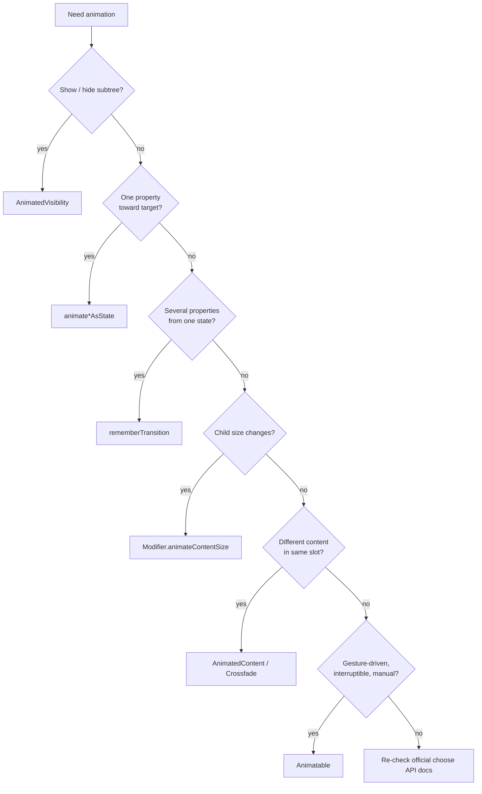

# Compose Animations 深度解析

对应 skill: [`compose-animations`](../skills/compose-animations/SKILL.md)

这一篇讲 Compose 动画 API 的选择：

> Pick the smallest animation API that matches the problem.

动画代码最常见的问题不是“不知道怎么动”，而是用了过重、过手工、生命周期不匹配的 API。例如用 `LaunchedEffect + Animatable` 写一个简单颜色过渡，或者用 alpha 动画假装移除 UI。

## 动画 API 决策图



## `AnimatedVisibility`

用于显示/隐藏 subtree，并且隐藏后内容应该离开 composition。

```kotlin
AnimatedVisibility(visible = expanded) {
    Details()
}
```

区别：

```kotlin
val alpha by animateFloatAsState(if (visible) 1f else 0f)
Box(Modifier.alpha(alpha)) {
    Details()
}
```

alpha 动画只改变视觉透明度：

- child 仍在 composition。
- child 仍参与 layout。
- child 可能仍保留 focus/state。
- accessibility 和 hit testing 需要额外处理。

如果语义是“这个内容出现/消失”，优先 `AnimatedVisibility`。

## `animate*AsState`

用于单个值向 target 过渡：

```kotlin
val width by animateDpAsState(
    targetValue = if (expanded) 200.dp else 56.dp,
    animationSpec = spring(
        dampingRatio = 0.7f,
        stiffness = Spring.StiffnessMedium,
    ),
    label = "fabWidth",
)
```

适合：

- alpha。
- color。
- width / height。
- offset。
- scale。
- shape corner。
- any value with converter。

要点：

- target 来自 state。
- API 自己持有动画状态。
- 简单目标动画不需要 `LaunchedEffect`。
- 给 animation 设置有意义的 `label`，方便 tooling/debug。

### 与 deferred reads 的关系

`animate*AsState` 返回 `State<T>`。如果动画值每帧变化，读的位置很重要。

可能不理想：

```kotlin
val offset by animateDpAsState(targetOffset)
Box(Modifier.offset(x = offset))
```

更适合 layout-phase read：

```kotlin
val offset = animateDpAsState(targetOffset)
Box(
    Modifier.offset {
        IntOffset(offset.value.roundToPx(), 0)
    },
)
```

详见：

[compose-state-deferred-reads.md](./compose-state-deferred-reads.md)

## `rememberTransition`

当一个 state 同时驱动多个 animated values，使用 `rememberTransition`。

```kotlin
enum class CardPhase { Collapsed, Expanded }

val transition = rememberTransition(
    targetState = phase,
    label = "cardPhase",
)

val alpha by transition.animateFloat(label = "alpha") {
    if (it == CardPhase.Expanded) 1f else 0f
}

val elevation by transition.animateDp(label = "elevation") {
    if (it == CardPhase.Expanded) 12.dp else 2.dp
}
```

不要用多个独立 `animate*AsState` 表达一个统一视觉状态，否则 specs、target、label、timing 容易漂移。

## `Modifier.animateContentSize`

当 child layout size 因内容变化而改变，使用：

```kotlin
Column(Modifier.animateContentSize()) {
    Text(text)
    if (expanded) {
        Details()
    }
}
```

适合：

- 文本展开/收起。
- chip 内容变化。
- 动态表单区域。
- child intrinsic size 变化。

不要为了简单尺寸变化手写 `animateDpAsState`，除非你确实需要控制具体 size target。

## `AnimatedContent` 与 `Crossfade`

用于同一个区域中不同 composable content 的切换。

简单淡入淡出：

```kotlin
Crossfade(
    targetState = selectedTab,
    label = "tab-content",
) { tab ->
    TabContent(tab)
}
```

需要自定义 transition、size transform、方向等：

```kotlin
AnimatedContent(
    targetState = step,
    label = "checkout-step",
) { targetStep ->
    StepContent(targetStep)
}
```

### `contentKey`

当 target state 是 rich wrapper，例如：

```kotlin
sealed interface AsyncResult<out T> {
    data object Loading : AsyncResult<Nothing>
    data class Success<T>(val value: T) : AsyncResult<T>
    data class Error(val throwable: Throwable) : AsyncResult<Nothing>
}
```

通常动画应该跟随 visual shape，而不是每次 payload refresh 都动画。

```kotlin
AnimatedContent(
    targetState = result,
    contentKey = { state ->
        when (state) {
            AsyncResult.Loading -> "loading"
            is AsyncResult.Success -> "content"
            is AsyncResult.Error -> "error"
        }
    },
    label = "profile-content",
) { state ->
    when (state) {
        AsyncResult.Loading -> Loading()
        is AsyncResult.Success -> Profile(state.value)
        is AsyncResult.Error -> ErrorMessage(state.throwable)
    }
}
```

没有 `contentKey` 时，每个 unequal `Success(value)` 都可能被当成新内容。

## `Animatable`

`Animatable` 适合更底层、手动、可中断动画：

- gesture-driven drag / fling。
- `snapTo`。
- decay。
- 需要手动串行动画。
- 需要取消、抢占、根据 velocity 继续。

不适合拿来替代简单 `animate*AsState`。

错误倾向：

```kotlin
LaunchedEffect(expanded) {
    animatable.animateTo(if (expanded) 1f else 0f)
}
```

如果只是 target alpha：

```kotlin
val alpha by animateFloatAsState(
    targetValue = if (expanded) 1f else 0f,
    label = "alpha",
)
```

更简单、更符合声明式模型。

## Navigation transitions

如果切换来自 Navigation Compose destination，优先使用 navigation 提供的 transition API。不要在同一个 destination swap 外面再套一层 `AnimatedContent`，否则会重复表达同一个状态切换，生命周期也更难判断。

## 常见错误

1. 用 alpha 动画隐藏内容，却期待内容 unmount。
2. 多个 `animate*AsState` 表达同一个 phase，结果不同步。
3. 简单 target animation 用 `LaunchedEffect + Animatable` 手写。
4. `AnimatedContent(targetState = asyncResult)` 在数据刷新时频繁动画。
5. 动画值用 `by` 在 composition 中每帧读取，引发不必要 recomposition。
6. destination transition 不用 nav API，外层自己包 content animation。

## 专家级审查清单

1. 这是 subtree 出现/消失，还是只改变一个属性？
2. 隐藏后内容是否应该离开 composition？
3. 多个 animated values 是否由同一个 state 驱动？
4. 动画值是否 frame-rate 进入 composition？
5. `AnimatedContent` 的 key 是 payload，还是 visual shape？
6. 是否用过重的 `Animatable` 处理简单 target animation？
7. 动画 API 是否和 Navigation / gesture / layout ownership 匹配？

## 精髓总结

1. 先用最小 API：visibility、单值、多值、content swap、manual motion。
2. alpha 不是 unmount；显示/隐藏 subtree 用 `AnimatedVisibility`。
3. 多属性同状态用 `rememberTransition`。
4. Rich state 切换用 `contentKey` 控制动画 identity。
5. 动画值频繁变化，注意 deferred reads。
