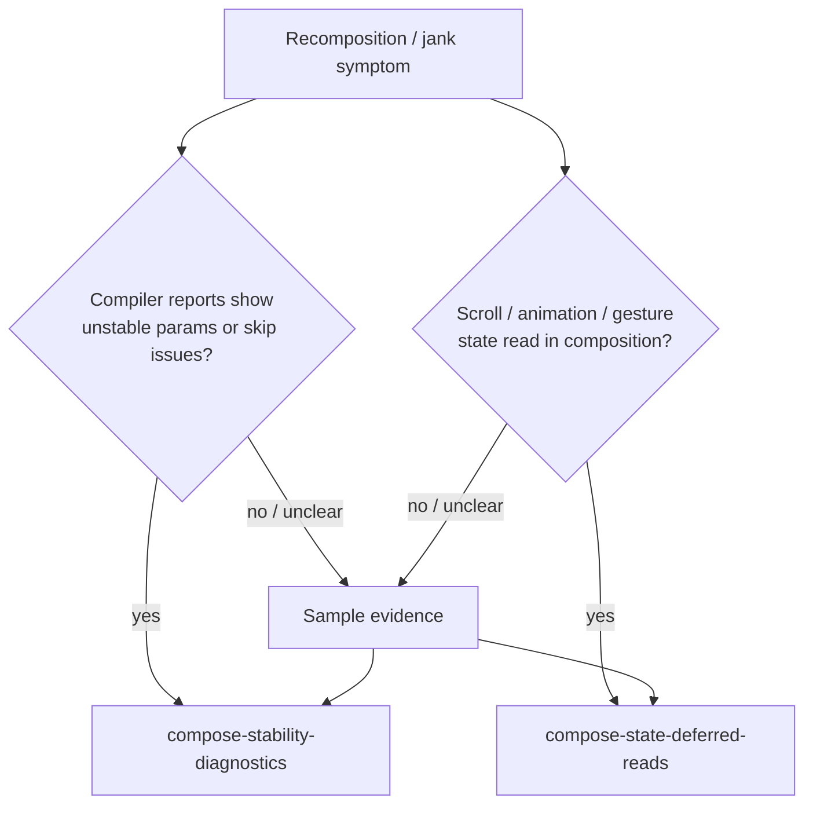

# Compose Recomposition Performance 深度解析

对应 skill: [`compose-recomposition-performance`](../skills/compose-recomposition-performance/SKILL.md)

这一篇是 Compose 性能排查的入口文档。它本身不是“修复手册”，而是一个 router：

> 当你看到 recomposition 过多、Layout Inspector 计数异常、compiler reports 里 skippable / restartable / unstable 信息可疑，或者滚动/动画时 UI 抖动，要先判断问题属于哪条轴。

真正深入修复分别在：

- [`compose-stability-diagnostics`](./compose-stability-diagnostics.md)：参数稳定性、skipping、compiler reports。
- [`compose-state-deferred-reads`](./compose-state-deferred-reads.md)：高频 State 读取发生在 composition、layout 还是 draw。

## 核心原则

Compose recomposition 性能问题常见有两条独立轴：

1. **Parameter stability / skipping**
   - Runtime 能不能跳过某个 restartable composable？
   - 参数是否稳定？
   - 参数比较是否便宜且符合预期？
   - 调用方是否每次重组都创建新实例，导致 skipping 失效？

2. **Where State is read**
   - 高频 `State` 是在 composition 阶段读的吗？
   - 滚动、动画、手势这类 frame-rate state 是否本来只影响 layout/draw，却被提前读进 composition？

这两条轴可以单独存在，也可以叠加。



## 不要把所有 recomposition 都当成 bug

Compose 的工作模型本来就是：

- State 变化。
- 读过 State 的 scope 失效。
- Runtime 尽量重组必要部分。
- Skippable child 尽量跳过。

所以“发生了 recomposition”不等于“性能问题”。

真正需要排查的是：

- frame-rate recomposition 导致掉帧；
- 数据没有变化但参数 churn 导致跳不过去；
- 大型 subtree 因为顶层读了高频 State 而每帧重组；
- Layout Inspector 或 trace 显示 expensive composable 被频繁执行；
- compiler reports 显示关键 UI state 类型不稳定，且实例不断变化。

## 两条轴的区别

### 轴一：参数稳定性 / skipping

问题形态：

```kotlin
@Composable
fun ProductList(
    items: List<ProductUi>,
    onProductClick: (ProductId) -> Unit,
) {
    // expensive list UI
}
```

如果 `items` 每次 parent recomposition 都是一个新的 unstable `List` 实例，runtime 可能无法按照你期望跳过 `ProductList`。

排查方向：

- compiler `composables.txt` / `classes.txt`。
- 参数是否 stable。
- Kotlin 2.0.20+ strong skipping 下，unstable 参数是否按 identity 比较。
- 调用方是否创建新 collection / wrapper / lambda。
- UI state 是否应该使用 immutable collection 或稳定 wrapper。

进入：

[compose-stability-diagnostics.md](./compose-stability-diagnostics.md)

### 轴二：State 读取阶段

问题形态：

```kotlin
@Composable
fun CollapsingHeader(listState: LazyListState) {
    val offset = listState.firstVisibleItemScrollOffset

    Header(
        modifier = Modifier.graphicsLayer(
            translationY = -offset / 2f,
        ),
    )
}
```

这里 scroll offset 在 composable body 中读取。滚动时它每帧变化，因此会触发 composition。

如果这个值只影响绘制或位置，应该尽量把读取推迟到 layout/draw：

```kotlin
Header(
    modifier = Modifier.graphicsLayer {
        translationY = -listState.firstVisibleItemScrollOffset / 2f
    },
)
```

进入：

[compose-state-deferred-reads.md](./compose-state-deferred-reads.md)

## 排查顺序

推荐顺序：

1. **确认是否真的有性能问题**
   - 是否有掉帧、卡顿、trace 证据？
   - 还是只是 recomposition counter 增长？

2. **判断是否是 frame-rate state**
   - scroll offset？
   - animation value？
   - gesture / drag position？
   - pointer input 状态？

3. **判断是否是参数 churn**
   - composable 参数是否每次都新建？
   - collection、lambda、wrapper、UI state 是否稳定？
   - compiler reports 是否支持这个怀疑？

4. **分别修复后重新测量**
   - 不要一次性改稳定性、拆组件、改 modifier、换 collection。
   - 每次修复后重新看 trace / counter / frame time。

## 常见误判

### 误判一：看到 recomposition counter 增长就优化

Counter 增长可能是正常的。真正要看：

- 执行的 composable 是否 expensive；
- 是否每帧发生；
- 是否导致 layout/draw 过重；
- 是否用户可感知。

### 误判二：只看 stability reports，不看 State 读取阶段

如果 jank 发生在滚动、动画、拖拽期间，第一怀疑通常应该是高频 State 在 composition 中读取，而不是先改 `@Immutable`。

### 误判三：所有 unstable 都必须修

Kotlin 2.0.20+ strong skipping 改变了语境。unstable 参数不再自动意味着 restartable composable 不可跳过。真正要看：

- unstable 参数按 identity 比较是否符合预期；
- 是否每次创建新实例；
- 是否需要 equality-based stable semantics。

### 误判四：把业务数据变化当性能 bug

如果用户输入导致列表过滤、远端数据刷新、UI state 确实变化，那么 recomposition 是正确行为。要优化的是工作量和读写位置，不是阻止 UI 更新。

## 专家级审查清单

1. 这个性能问题有 runtime 证据吗，还是只是感觉？
2. 问题发生在滚动、动画、手势这类 frame-rate 场景吗？
3. 高频 State 是否在 composable body 中读取？
4. 高频值是否跨 composable boundary 以普通 value 形式传递？
5. compiler reports 是否显示关键 composable 不可跳过或参数 unstable？
6. 项目是否使用 Kotlin 2.0.20+ strong skipping？
7. unstable 参数是长期同一实例，还是每次 recomposition 都创建新实例？
8. 修复后是否重新测量，而不是凭代码形状判断？

## 精髓总结

`compose-recomposition-performance` 不是直接告诉你“加 `@Stable`”或“拆 composable”，而是先分诊：

1. **参数稳定性问题**：去看 stability diagnostics。
2. **高频 State 读取阶段问题**：去看 deferred reads。
3. **两者都有证据**：两条线都修，但分步测量。
4. **没有证据**：不要为了 report cleanliness 或 counter 数字做无意义重构。
