# Compose Runtime、SlotTable 与 Snapshot 系统深度解析

本文解释 Jetpack Compose 中三个经常被混在一起的概念：

- **Compose runtime**：负责执行 composition、维护 composition 状态、安排 recomposition、把变更应用到 UI 树。
- **SlotTable**：runtime 的内部数据结构，用来记录 composition hierarchy、`remember` 值、参数历史和跳过/重启所需的信息。
- **Snapshot 系统**：Compose observable state 的一致性、读写隔离、读观察、写通知机制。

本文是理解 [`compose-state-authoring`](../skills/compose-state-authoring/SKILL.md) 的底层模型。内容基于 Android 官方文档、Compose runtime API reference 和 AOSP runtime design 文档。需要注意：`SlotTable` 是内部实现，细节会随 Compose runtime 版本演进；本文只把稳定概念作为结论，把实现细节作为模型帮助理解。

## 参考资料

- [Jetpack Compose phases](https://developer.android.com/develop/ui/compose/phases)
- [State and Jetpack Compose](https://developer.android.com/develop/ui/compose/state)
- [Thinking in Compose](https://developer.android.com/develop/ui/compose/mental-model)
- [Compose runtime release notes](https://developer.android.com/jetpack/androidx/releases/compose-runtime)
- [Snapshot API reference](https://developer.android.com/reference/kotlin/androidx/compose/runtime/snapshots/Snapshot)
- [AOSP: How Composition Works](https://android.googlesource.com/platform/frameworks/support/+/54d616ad45cd299432d4872fad96f406da51465d/compose/runtime/design/how-compose-works.md)

## 一句话总览

Compose 的核心链路可以这样理解：

> Compose 的核心链路可以理解为：Composable 执行时读取 State，runtime 将这次读取记录到当前 RecomposeScope；当 State 发生被 mutation policy 判定为有效的变化，并且 snapshot 变化被应用后，相关 RecomposeScope 会被标记为 invalid；随后 Recomposer 在合适的帧时机调度 recomposition。重组过程中，Composer 依靠 SlotTable 恢复上一次 composition 的位置信息、remember 值和参数历史，对满足条件的 group 执行 skip，对需要变化的部分重新执行，并通过 applyChanges 将插入、删除、移动、更新等变更应用到 Compose 的节点树

## Frame 级别流程

Android 官方文档把 Compose 渲染一帧分为三个主要阶段：composition、layout、drawing。

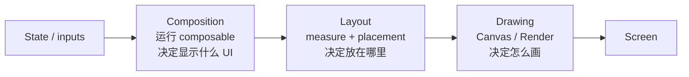

这三个阶段不是“每次都完整执行”。Compose 会尽量跳过不必要的工作：

- composition 阶段读到的 State 发生有效变化，通常会触发 recomposition。
- layout 阶段读到的 State 发生有效变化，可以跳过 composition，重新执行相关 measure/place 工作，然后 draw。
- draw 阶段读到的 State 发生有效变化，可以跳过 composition 和 layout，只重新 draw。

这就是为什么高频状态要尽量延迟读取。例如滚动偏移、动画颜色、手势位置，如果在 composition 顶层读取，会让整个 composable 路径进入 recomposition；如果通过 lambda-based modifier 推迟到 layout 或 draw 阶段读取，runtime 可以跳过更多工作。

## Runtime 组成

下面是概念层面的组件关系，不是源码类的一一完整映射：

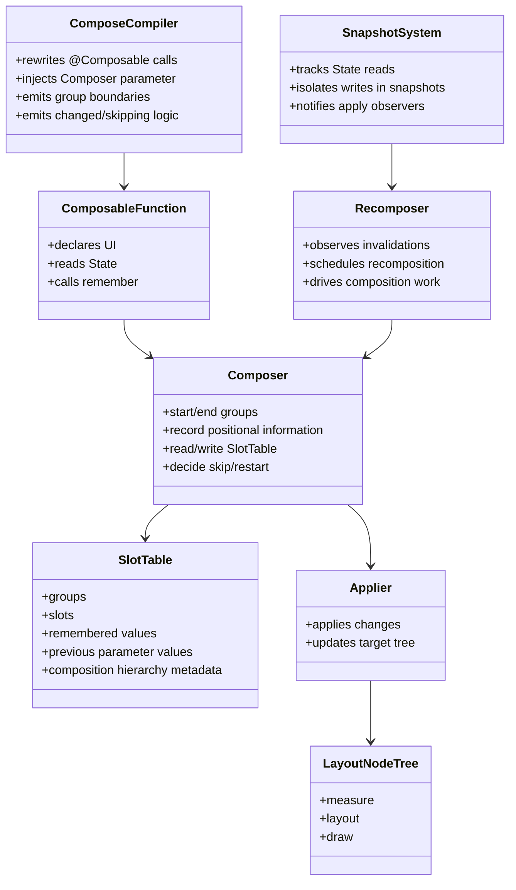

关键点：

- `@Composable` 调用不是普通函数调用。Compose Compiler 会为它们注入 runtime 协议，例如 group 边界、参数变化检查、跳过逻辑和 restart 逻辑。
- Composer 是 runtime 执行 composition 的核心对象。它不是 UI 控件，也不是布局系统；它维护 composition 的位置、历史和变化。
- SlotTable 是 Composer 的内部记录表。它不是 DOM，也不是最终渲染树。
- Android Compose UI 最终更新的是 LayoutNode tree。不是每个 composable 都对应一个 LayoutNode；一个 composable 可以产生 0 个、1 个或多个 UI 节点。

## Slot、Group、SlotTable

很多问题来自一句模糊说法：“`remember` 保存在 SlotTable 里”。这句话大体对，但不够精确。

### Group 是位置信息单位

Compose runtime 需要知道：

- 这次执行到了 composition tree 的哪个位置？
- 这个位置上次有什么？
- 这个位置的参数上次是什么？
- 这个位置有没有 remembered value？
- 这个位置是否可以跳过？
- 如果结构变化了，哪些 group 被插入、删除、移动？

为了解决这些问题，compiler 会在 composable 调用周围插入类似 `startGroup` / `endGroup` 的 runtime 协议。AOSP 设计文档中用简化伪代码说明：

```kotlin
fun A(composer: Composer) {
    composer.startGroup(1234)
    val data = remember(composer) { Data() }
    // ...
    composer.endGroup()
}
```

这里的 `1234` 可以理解为 compiler 根据代码位置生成的 key。真实实现比这个复杂，但核心思想是：runtime 用 group 记录 composition call tree 中的位置。

### Slot 存放 remembered value 和历史值

SlotTable 记录的是一棵 group tree 的扁平化表示，并附带 slot values。slot 中可能保存：

- `remember { ... }` 的结果。
- 参数历史值，用于后续 `changed(...)` 比较。
- runtime 需要的其他 composition 记忆。

概念图：

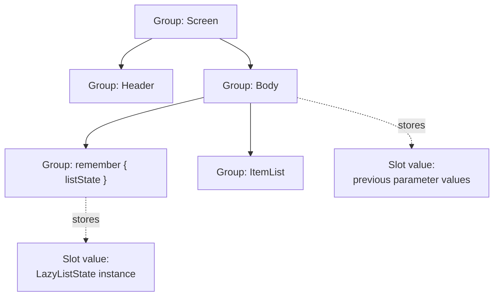

注意：

- Group 不是 UI 节点。
- Slot 不是 UI 节点。
- `remember` 的值不是“挂在 composable 对象上”，因为 composable 没有对象实例语义；它挂在 composition 位置上。

### Positional memoization

`remember` 的关键不是“缓存 lambda 结果”，而是 **positional memoization**。

```kotlin
@Composable
fun A() {
    val data = remember { Data() }
}

@Composable
fun B() {
    A()
    A()
}
```

第一次执行 `B()` 时，两次 `A()` 是两个不同的 composition 位置，因此会创建两个不同的 `Data`。

重组时，只要这两个位置仍然存在，`remember` 不会重新调用 lambda，而是从对应 slot 取回上次的值。

这解释了为什么下面两个状态不是同一个：

```kotlin
Column {
    Counter()
    Counter()
}
```

它们调用的是同一个函数，但处在不同 composition 位置。

## 条件分支与 Slot identity

由于 `remember` 和位置绑定，动态结构必须谨慎。

```kotlin
@Composable
fun Screen(showHeader: Boolean) {
    if (showHeader) {
        Header()
    }

    var text by remember { mutableStateOf("") }

    TextField(value = text, onValueChange = { text = it })
}
```

Compose compiler/runtime 会通过 group 边界处理条件结构。通常这段代码是安全的；重点不是“条件前面不能有 remember”，而是：

> 当同一批数据会插入、删除、重排时，必须给 runtime 稳定 identity。

典型场景是列表。

错误倾向：

```kotlin
LazyColumn {
    items(users) { user ->
        var expanded by remember { mutableStateOf(false) }
        UserRow(user, expanded)
    }
}
```

如果 `users` 重排或插入，remembered state 可能跟随位置，而不是跟随业务对象。

更稳妥：

```kotlin
LazyColumn {
    items(
        items = users,
        key = { it.id },
    ) { user ->
        var expanded by remember { mutableStateOf(false) }
        UserRow(user, expanded)
    }
}
```

`key` 给 runtime 一个业务稳定身份，使 movable content、state retention 和 slot 匹配更符合开发者意图。

## Recomposition、Skipping、Restarting

Composition 首次运行会建立 SlotTable 和 UI tree。后续 State 改变不会盲目全量重跑所有 composable，而是 recomposition。

### Restart scope

当 composable 在 composition 阶段读取 `MutableState.value`，runtime 会记录：

```text
这个 State 被哪个 restart scope 读过
```

当该 State 发生成功应用的有效变化后，对应 restart scope 会 invalidated。下一次 recomposition，runtime 从这些 scope 开始重新执行相关 composable。

概念时序：

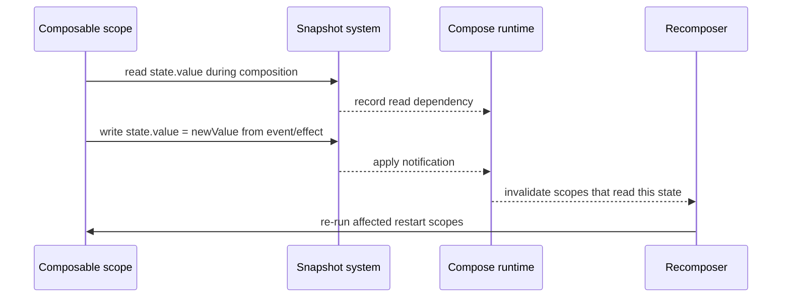

### Skipping

Skipping 是另一层优化：即使某个 parent recomposed，child 也可能被跳过。

简化规则：

- 如果一个 composable 是 skippable；
- 并且它在同一 composition 位置上的参数和上次相比没有变化；
- runtime 可以跳过它的函数体，直接复用上次 composition 结果。

这就是稳定性、不可变类型、value class、参数 equality 对 Compose 性能重要的原因。

### Restart 和 Skip 的区别

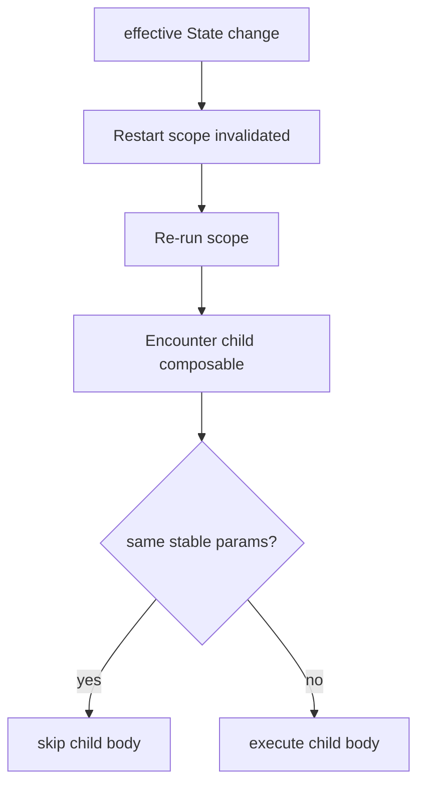

Restart 解决“从哪里重新开始执行”；Skipping 解决“执行过程中哪些 child 可以不跑”。

## Snapshot 系统

`mutableStateOf` 返回的 `MutableState<T>` 不是普通 observable。它参与 Compose Snapshot 系统。

官方 API reference 对 `Snapshot` 的几个关键事实是：

- 每个线程有当前 active snapshot；没有显式 snapshot 时使用 global snapshot。
- 在 snapshot 中读取 state object，会得到该 snapshot 对应的值。
- mutable snapshot 中的写入在 apply 之前对其他线程不可见。
- mutable snapshot 可以把修改原子应用到 global state 或父 snapshot。
- snapshot apply 后会通知 snapshot observers，例如 `snapshotFlow`。

`mutableStateOf` 还有 mutation policy。默认策略通常按结构相等判断值是否等价；如果新旧值被策略认为等价，这次赋值不一定会产生可观察变化，也就不应被理解为必然触发 recomposition。

概念模型：

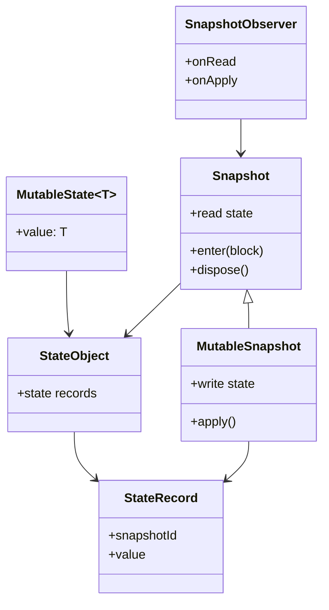

上图是理解模型，不是要求业务代码直接操作这些内部结构。绝大多数业务代码只需要使用 `mutableStateOf`、`mutableStateListOf`、`derivedStateOf`、`snapshotFlow` 等公开 API。

### Snapshot 解决什么问题

传统 observable 只关心“值变了，通知 listener”。Compose 需要更多能力：

- 在 composition 中记录“谁读了什么”。
- 在写入时知道“哪些读者可能受影响”。
- 允许同一段执行看到一致的 state 视图。
- 支持隔离写入，直到 apply 时再对外可见。
- 支持冲突检测。
- 支持跨线程 snapshot 语义。

这就是 Snapshot 系统存在的原因。

## `mutableStateOf` 的读写链路

读取：

```kotlin
val title by remember { mutableStateOf("Hello") }
Text(title)
```

composition 阶段发生了：

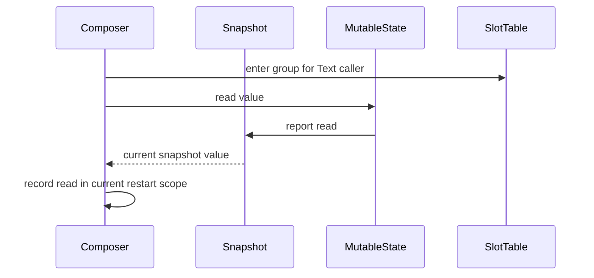

写入：

```kotlin
title = "World"
```

写入后发生的是：

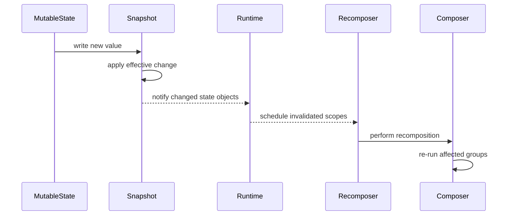

关键点：

- 不是“State 变了，全屏重绘”。
- 是“State 变了，读过它的 restart scopes 失效；后续 recomposition 尽量跳过不需要重跑的部分”。
- State 在哪个阶段被读，会影响 invalidation 后需要重新执行的阶段。
- 写入是否真的产生 invalidation，还取决于对应 State 的 mutation policy 是否认为新旧值不同。

## 为什么普通变量不行

```kotlin
@Composable
fun Counter() {
    var count = 0

    Button(onClick = { count++ }) {
        Text("$count")
    }
}
```

这个 `count` 同时缺失两种能力：

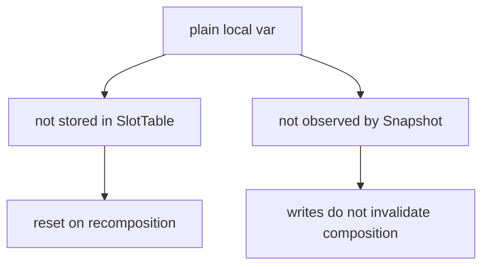

而正确写法：

```kotlin
var count by remember { mutableStateOf(0) }
```

组合了两个机制：

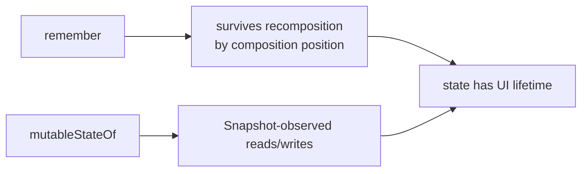

## 为什么 `mutableStateOf(mutableListOf())` 容易错

错误模型：

```kotlin
var users by remember { mutableStateOf(mutableListOf<User>()) }
users.add(user)
```

`users.add(user)` 改的是 `MutableList` 内部，不是 `MutableState.value`。

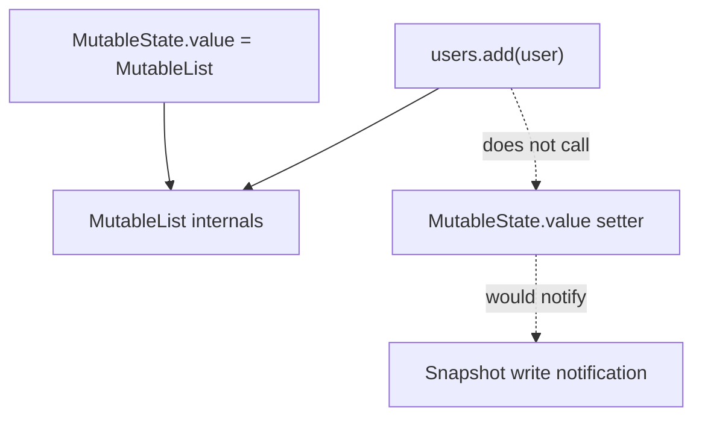

正确方向一：替换 immutable value。

```kotlin
var users by remember { mutableStateOf<List<User>>(emptyList()) }
users = users + user
```

正确方向二：使用 snapshot-aware collection。

```kotlin
val users = remember { mutableStateListOf<User>() }
users.add(user)
```

`mutableStateListOf` 的 mutation 参与 Snapshot 系统，因此 runtime 能观察到变化。

## SlotTable 与 Snapshot 的分工

这两个系统经常被混淆。它们解决的是不同问题。

| 问题 | SlotTable | Snapshot |
|---|---|---|
| `remember` 的值放在哪里 | 是 | 否 |
| composition call tree 的位置信息 | 是 | 否 |
| 参数上次的值，用于 changed/skip | 是 | 否 |
| State 当前值和历史记录 | 否 | 是 |
| 读依赖追踪 | 间接参与 restart scope | 是 |
| 写入隔离和 apply | 否 | 是 |
| 通知 recomposition | 否，依赖 runtime/recomposer | 是，通知变更 |
| UI tree 节点存储 | 否 | 否 |

更准确地说：

- SlotTable 让 runtime 知道“代码执行到 composition tree 的哪个位置，以及这个位置上次存了什么”。
- Snapshot 让 runtime 知道“哪些 observable state 被读写了，以及写入何时对外可见”。
- Recomposer 把 Snapshot 的变更和 SlotTable 中可重启的位置连接起来。

## `@ReadOnlyComposable` 与 SlotTable

`@ReadOnlyComposable` 的意义在于告诉 runtime：这个 composable 只读 composition state，不参与 composition 结构，不需要普通 composable group。

适合：

```kotlin
val AppTheme.spacing: Dp
    @Composable
    @ReadOnlyComposable
    get() = LocalSpacing.current.medium
```

不适合：

```kotlin
@Composable
@ReadOnlyComposable
fun Header() {
    Text("Hello")
}
```

因为 `Text` 会参与 UI tree 构建。

也不适合：

```kotlin
@Composable
@ReadOnlyComposable
fun rememberThing(): Thing {
    return remember { Thing() }
}
```

因为 `remember` 需要 positional slot。一个需要 slot 的函数不能声称自己是 read-only composition accessor。

## 常见误解

### 误解一：Composable 是 UI 节点

不是。Composable 是描述 UI 的函数。它可以产生 0 个、1 个或多个节点，也可以只是读取 token 并返回值。

### 误解二：SlotTable 是 UI 树

不是。SlotTable 是 composition 的内部记忆结构。UI 渲染依赖的是 applier 管理的目标树，在 Android Compose UI 中主要是 LayoutNode tree。

### 误解三：`remember` 按函数名缓存

不是。`remember` 按 composition 位置记忆。同一个 composable 函数被调用两次，会有两个位置和两份 remembered value。

### 误解四：`mutableStateOf` 能观察对象内部所有变化

不能。`mutableStateOf` 观察的是 State value 的读写。内部 mutable object 的变化如果没有走 State setter，也不是 snapshot-aware collection mutation，Compose 不会知道。

### 误解五：State 一变就整个界面重组

不是。Compose 记录读依赖，失效的是读过该 State 的 scope；重组过程中还能根据参数和稳定性跳过子树。

### 误解六：Snapshot 等于数据库事务

不等于。Snapshot 提供 state 读写隔离、apply 和冲突语义，但它是 Compose runtime 状态系统，不是持久化事务系统，也不是业务并发控制的替代品。

## 专家级审查清单

看 Compose 状态代码时，可以按这个顺序判断：

1. 这个值是否需要 survive recomposition？如果需要，不能是 composable body 的普通局部变量。
2. 这个值的变化是否需要驱动 UI？如果需要，必须是 Compose 能观察到的 State 写入。
3. 这个状态是否只是本地 UI 记忆？如果不是，考虑上提到调用方、state holder 或 ViewModel。
4. 这个状态是否在动态列表中？如果是，列表是否有稳定 `key`？
5. 这个状态是否高频变化？如果是，是否可以把读取推迟到 layout/draw 阶段？
6. 是否把 mutable collection 包进了 `mutableStateOf` 却只改内部内容？
7. 是否错误使用了 `@ReadOnlyComposable`，但函数内部实际 emit UI、调用 `remember` 或注册 effect？

## 结论

Compose 的状态模型可以浓缩成三层：

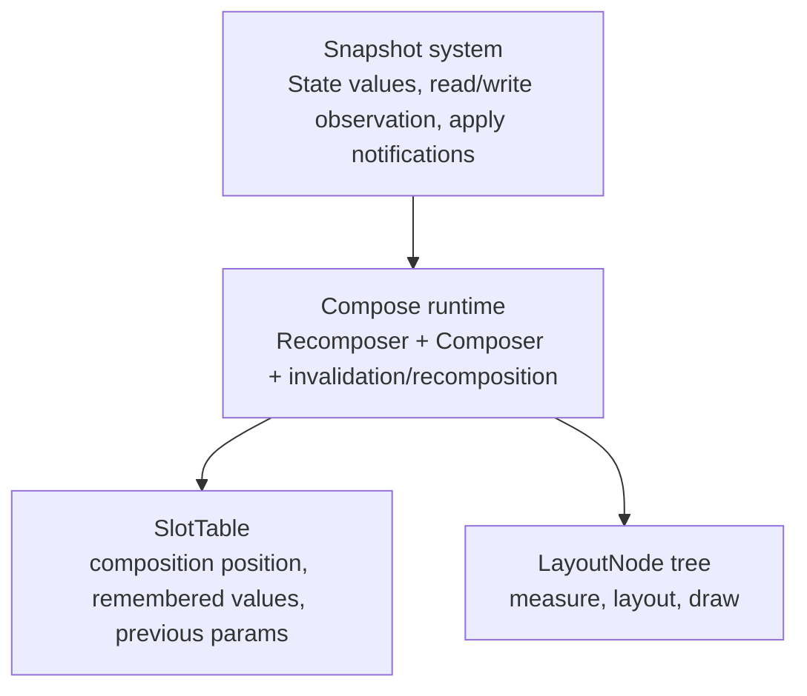

写 Compose 状态代码时，真正的问题不是“该不该用 `remember`”，而是：

- 生命周期由谁提供？
- 读写是否进入 Snapshot 系统？
- identity 是否稳定？
- 读发生在哪个阶段？
- runtime 是否能安全跳过不需要重跑的部分？

能回答这五个问题，才算真正理解了 `compose-state-authoring` 背后的 runtime 模型。
