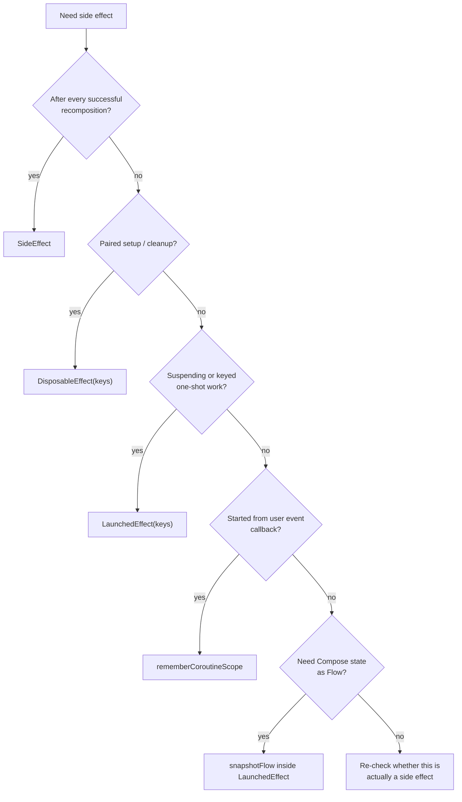
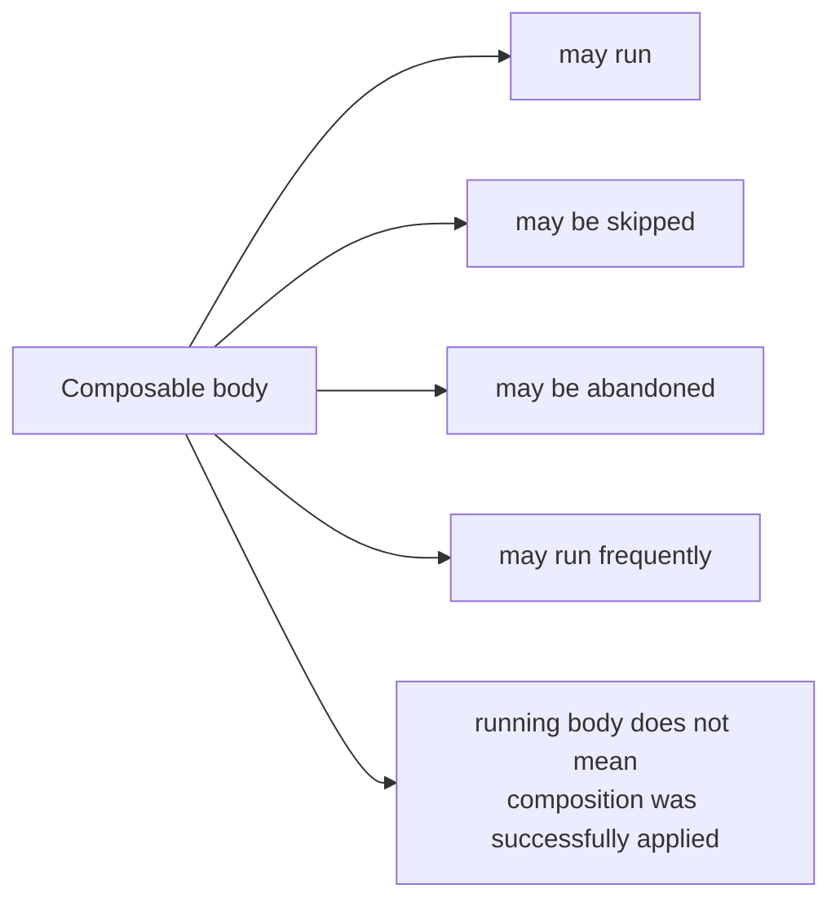
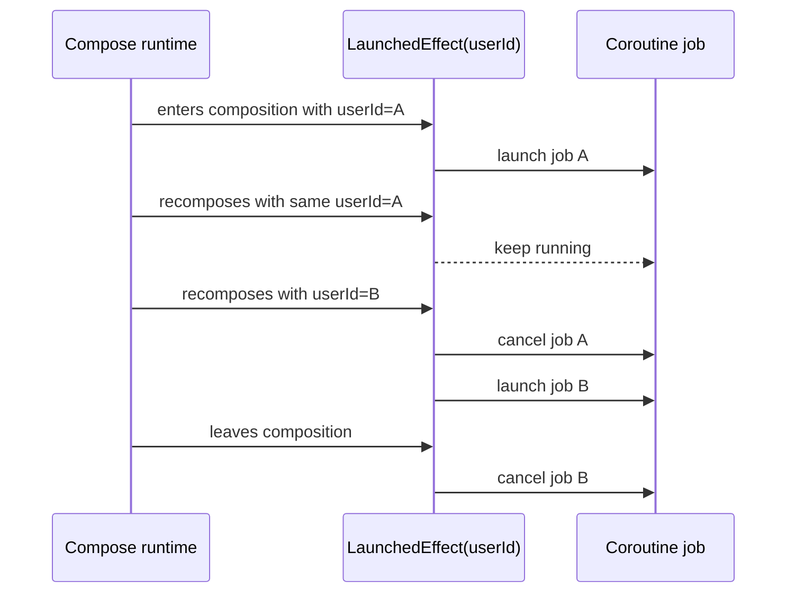
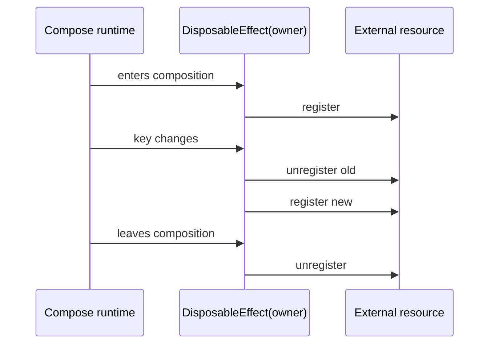

# Compose Side Effects 深度解析

对应 skill: [`compose-side-effects`](../skills/compose-side-effects/SKILL.md)

前几篇文档已经建立了三个基础：

- [`compose-state-authoring`](./compose-state-authoring.md)：状态如何 survive recomposition 并被 Snapshot 系统观察。
- [`compose-state-hoisting`](./compose-state-hoisting.md)：状态应该由谁拥有。
- [`compose-state-holder-ui-split`](./compose-state-holder-ui-split.md)：state holder wiring 与 UI rendering 如何拆开。

这一篇讲 Compose 中最容易写错、也最容易产生隐性 bug 的主题：

> Side effects 应该放在哪里，以及用哪个 effect API 承载它的生命周期。

## 核心原则

`compose-side-effects` 的核心原则是：

> Composable bodies describe UI. Work that changes the outside world belongs in an effect API whose lifecycle matches the work.

Composable body 不是“初始化函数”，也不是“只运行一次的 render 方法”。它可能：

- 被频繁 recomposed。
- 被 runtime 跳过。
- 被中途取消或丢弃。
- 以不同顺序执行。
- 在未来 runtime 优化中并行执行。

因此，任何会改变外部世界的代码，都不应该直接写在 composable body 里。

外部世界包括：

- 网络请求。
- 数据库写入。
- analytics / logging。
- navigation。
- snackbar / toast。
- focus request。
- 注册 listener / observer。
- 启动 coroutine。
- 调用 imperative UI API。
- 写入非 Compose 对象的属性。

错误示例：

```kotlin
@Composable
fun ProfileScreen(userId: UserId, analytics: Analytics) {
    analytics.setCurrentUser(userId)

    Text("Profile")
}
```

这段代码看起来只是同步一个 analytics 属性，但它直接写在 composable body 里。每次 recomposition 都可能执行，且是否执行不应该成为业务语义的一部分。

更正确：

```kotlin
@Composable
fun ProfileScreen(userId: UserId, analytics: Analytics) {
    SideEffect {
        analytics.setCurrentUser(userId)
    }

    Text("Profile")
}
```

如果语义是“进入某个 userId 的页面时记录一次 impression”，则不是 `SideEffect`，而应该是 keyed `LaunchedEffect`：

```kotlin
LaunchedEffect(userId) {
    analytics.logProfileViewed(userId)
}
```

effect API 的选择取决于生命周期语义，不取决于“哪个 API 我最熟”。

## Effect API 决策表

| Need | API |
|---|---|
| 每次成功 recomposition 后，把 Compose state 发布给非 Compose 对象 | `SideEffect` |
| 注册并在 key 变化或离开 composition 时注销 listener / observer / resource | `DisposableEffect(keys...)` |
| 运行 suspending、deferred、keyed one-shot work | `LaunchedEffect(keys...)` |
| 用户点击、手势等 callback 中启动 suspending work | `rememberCoroutineScope()` |
| 在 coroutine 中把 Compose snapshot reads 转成 Flow | `snapshotFlow { ... }` inside `LaunchedEffect` |
| 长生命周期 effect 不想 restart，但需要最新 callback / value | `rememberUpdatedState(...)` |

概念图：



## Composable body 为什么不能做 side effect

错误：

```kotlin
@Composable
fun Article(articleId: ArticleId, repository: ArticleRepository) {
    repository.markSeen(articleId)
    ArticleContent(articleId)
}
```

问题不是“这行代码可能执行多次”这么简单，而是 composable body 没有你以为的执行语义：



因此 body 里直接执行外部写入会造成：

- 重复请求。
- 重复埋点。
- composition 被取消但 side effect 已经发生。
- 代码依赖执行顺序。
- preview / test 触发真实外部行为。

如果是业务加载，通常应该移到 ViewModel / state holder：

```kotlin
class ArticleViewModel(
    private val repository: ArticleRepository,
) : ViewModel() {
    fun load(articleId: ArticleId) {
        // business loading lifecycle
    }
}
```

如果是 UI-owned keyed work，才考虑 `LaunchedEffect(articleId)`。

## `SideEffect`

`SideEffect` 的语义是：

> 在每次 successful recomposition 后运行，用来把 Compose 中的状态发布到非 Compose 对象。

典型场景：

```kotlin
@Composable
fun AnalyticsUserProperty(
    userType: String,
    analytics: Analytics,
) {
    SideEffect {
        analytics.setUserProperty("userType", userType)
    }
}
```

适合 `SideEffect` 的情况：

- 非 suspend。
- 不需要 cleanup。
- 不是一次性事件。
- 应该在每次成功 recomposition 后把最新值同步出去。

不适合：

```kotlin
SideEffect {
    repository.refresh()
}
```

如果是网络请求、数据库写入、一次性埋点、navigation、snackbar，这通常不是 `SideEffect`。

### `SideEffect` vs 直接写 body

差异在于：`SideEffect` 只在 successful recomposition 之后执行。Composable body 运行不等于 composition 成功提交。

所以：

```kotlin
SideEffect {
    externalObject.value = composeValue
}
```

比：

```kotlin
externalObject.value = composeValue
```

更符合 Compose runtime 语义。

## `LaunchedEffect`

`LaunchedEffect(keys...)` 用于 composition-owned coroutine。

它的生命周期：

- 进入 composition 时启动。
- key 变化时取消旧 coroutine，启动新 coroutine。
- 离开 composition 时取消 coroutine。

概念时序：



适合：

- keyed one-shot work。
- delay / timeout。
- collecting event flows。
- focus request after composition。
- snackbar / navigation event handling。
- snapshotFlow collection。

示例：userId 改变时重新收集事件：

```kotlin
LaunchedEffect(userId) {
    repository.events(userId).collect { event ->
        handle(event)
    }
}
```

错误：

```kotlin
LaunchedEffect(Unit) {
    repository.events(userId).collect { event ->
        handle(event)
    }
}
```

如果 `userId` 变化，collection 仍然使用第一次捕获的 `userId`。这是隐藏生命周期 bug。

## Effect keys

Keys 定义 effect 的 restart identity。

当任意 key 变化：

1. 旧 effect 被取消或 disposed。
2. 新 effect 以新的 key 启动。

选择 key 的原则：

- key 应该是 effect 生命周期真正跟随的对象。
- 用具体语义 key，例如 `userId`、`screenId`、`lifecycleOwner`、`focusRequester`。
- 不要用过宽对象，例如整个 `state` 或整个 `viewModel`，除非 effect 生命周期确实跟随它。
- 不要为了“消 lint”乱加 key。
- 不要把变化频繁的 lambda 加进 key，除非你真的想每次 lambda 变化都 restart。

错误：

```kotlin
LaunchedEffect(state) {
    analytics.logVisible(state.userId)
}
```

如果 `state` 里还有 `isLoading`、`name`、`avatarUrl`，这些变化都会重启 effect。

更精确：

```kotlin
LaunchedEffect(state.userId) {
    analytics.logVisible(state.userId)
}
```

## `rememberUpdatedState`

`rememberUpdatedState` 解决的是 stale capture。

场景：一个 long-running effect 不应该因为 callback 变化而 restart，但 effect 内部调用 callback 时应该使用最新 callback。

```kotlin
@Composable
fun Timeout(onTimeout: () -> Unit) {
    val latestOnTimeout by rememberUpdatedState(onTimeout)

    LaunchedEffect(Unit) {
        delay(1_000)
        latestOnTimeout()
    }
}
```

这里 effect 的生命周期是“进入 composition 后启动一次 timeout”。如果 parent recomposition 传入了新的 `onTimeout`，我们不想重启 delay，但 delay 结束后要调用最新 callback。

适合 `rememberUpdatedState` 的情况：

- splash timeout 不应因 callback identity 改变而重启。
- lifecycle observer 绑定同一个 owner，但回调逻辑要保持最新。
- 长时间 collector 不应重启，但 event handler 要保持最新。

### 不要用它逃避正确 key

错误：

```kotlin
val latestUserId by rememberUpdatedState(userId)

LaunchedEffect(Unit) {
    repository.events(latestUserId).collect { event ->
        handle(event)
    }
}
```

这里 `userId` 变化应该重启 collection，而不是更新捕获值。

正确：

```kotlin
LaunchedEffect(userId) {
    repository.events(userId).collect { event ->
        handle(event)
    }
}
```

判断标准：

> 如果值变化应该改变 effect 的生命周期，用 key。  
> 如果 effect 生命周期不变，只是内部调用要用最新值，用 `rememberUpdatedState`。

## `DisposableEffect`

`DisposableEffect(keys...)` 用于 paired setup / teardown。

典型场景：

- 注册 lifecycle observer。
- 注册 listener。
- 注册 callback。
- attach resource。
- 订阅非 Flow API。
- 设置需要恢复的外部对象状态。

示例：

```kotlin
@Composable
fun ObserveLifecycle(
    owner: LifecycleOwner,
    observer: LifecycleObserver,
) {
    DisposableEffect(owner, observer) {
        owner.lifecycle.addObserver(observer)

        onDispose {
            owner.lifecycle.removeObserver(observer)
        }
    }
}
```

生命周期：



规则：

> 每一条 registration path 都必须有匹配的 cleanup path。

错误：

```kotlin
LaunchedEffect(owner) {
    owner.lifecycle.addObserver(observer)
}
```

这个没有 cleanup。应该用 `DisposableEffect`。

## `rememberCoroutineScope`

`rememberCoroutineScope()` 用于从非 composable callback 里启动 coroutine，例如 click、gesture、menu action。

典型例子：

```kotlin
@Composable
fun SaveButton(snackbarHostState: SnackbarHostState) {
    val scope = rememberCoroutineScope()

    Button(
        onClick = {
            scope.launch {
                snackbarHostState.showSnackbar("Saved")
            }
        },
    ) {
        Text("Save")
    }
}
```

为什么不用 `LaunchedEffect`？

因为点击本身就是事件。不要为了触发 effect 额外制造 event flag。

错误：

```kotlin
var showSnackbar by remember { mutableStateOf(false) }

Button(onClick = { showSnackbar = true }) {
    Text("Save")
}

LaunchedEffect(showSnackbar) {
    if (showSnackbar) {
        snackbarHostState.showSnackbar("Saved")
        showSnackbar = false
    }
}
```

这把一个即时事件绕成了 state machine，容易产生重复触发、重置时机、配置变化等问题。

正确：

```kotlin
val scope = rememberCoroutineScope()

Button(
    onClick = {
        scope.launch {
            snackbarHostState.showSnackbar("Saved")
        }
    },
) {
    Text("Save")
}
```

`rememberCoroutineScope` 返回的 scope 跟随 composition 生命周期。离开 composition 时，scope 会被取消。

## Flow collection

### Event / side-effect Flow

用 `LaunchedEffect` 收集 side-effect/event flows：

- snackbar events。
- navigation events。
- analytics events。
- focus commands。
- permission commands。
- one-shot UI commands。

示例：

```kotlin
LaunchedEffect(events) {
    events.collect { event ->
        snackbarHostState.showSnackbar(event.message)
    }
}
```

这类 collection 不产生 UI tree，而是触发 imperative work，因此属于 side effect。

### Render state Flow

不要 imperatively collect render state，再手动写 local state：

```kotlin
var uiState by remember { mutableStateOf(ProfileUiState.Empty) }

LaunchedEffect(viewModel) {
    viewModel.state.collect { uiState = it }
}
```

在 Android 上，screen state 应该在 state-holder composable 中使用 lifecycle-aware collection：

```kotlin
val state by viewModel.state.collectAsStateWithLifecycle()
```

然后传给 plain UI composable：

```kotlin
ProfileScreen(
    state = state,
    onSaveClick = viewModel::save,
)
```

在没有 lifecycle-aware API 的 Compose target 上，可以使用 `collectAsState()`，同时按平台生命周期模型处理 collection owner。

### `snapshotFlow`

`snapshotFlow { ... }` 用于在 coroutine 中观察 Compose snapshot reads，并转换成 Flow。

典型场景：把 scroll index 转成 analytics event。

```kotlin
LaunchedEffect(listState) {
    snapshotFlow { listState.firstVisibleItemIndex }
        .distinctUntilChanged()
        .collect { index ->
            analytics.visibleIndex(index)
        }
}
```

注意：

- `snapshotFlow` block 里应该读取 Compose State。
- Flow chain 必须有 terminal operator，例如 `collect`。
- `snapshotFlow { ... }.map { ... }` 没有 `collect` 什么都不会发生。
- 对高频值通常配合 `distinctUntilChanged`、`debounce` 或 `sample`，取决于业务语义。

## UI imperative 操作

很多 Compose UI 操作是 imperative + suspending：

- `snackbarHostState.showSnackbar(...)`
- `drawerState.open()`
- `listState.animateScrollToItem(...)`
- `pagerState.animateScrollToPage(...)`
- focus request

它们应该由 composition-owned effect 或 composition-owned coroutine scope 调用。

例如进入页面后请求焦点：

```kotlin
val focusRequester = remember { FocusRequester() }

LaunchedEffect(focusRequester) {
    focusRequester.requestFocus()
}
```

用户点击后滚到顶部：

```kotlin
val scope = rememberCoroutineScope()
val listState = rememberLazyListState()

IconButton(
    onClick = {
        scope.launch {
            listState.animateScrollToItem(0)
        }
    },
) {
    Icon(Icons.Default.KeyboardArrowUp, contentDescription = null)
}
```

不要把这些调用放进 `viewModelScope`。ViewModel 可以发出“需要滚动”的状态或 event，但真正调用 UI runtime API 的地方应在 composition side-effect 边界。

## 与 state-holder/UI split 的关系

Side effects 通常应该靠近 state-holder composable，而不是藏在 plain UI layout 中。

示例：

```kotlin
@Composable
fun ProfileRoute(
    viewModel: ProfileViewModel,
    snackbarHostState: SnackbarHostState,
    navigator: Navigator,
) {
    val state by viewModel.state.collectAsStateWithLifecycle()

    LaunchedEffect(viewModel.effects) {
        viewModel.effects.collect { effect ->
            when (effect) {
                ProfileEffect.Saved -> snackbarHostState.showSnackbar("Saved")
                ProfileEffect.Back -> navigator.pop()
            }
        }
    }

    ProfileScreen(
        state = state,
        onSaveClick = viewModel::save,
        onBackClick = navigator::pop,
    )
}
```

这里 `ProfileScreen` 是 plain UI composable，不知道 `viewModel.effects`，也不知道 `navigator`。

这保持了：

- preview 友好。
- UI test 简单。
- effect lifecycle 明确。
- imperative target 在 wiring 层。

## 常见错误

### 错误一：网络请求直接写在 composable body

```kotlin
@Composable
fun UserScreen(userId: UserId, repository: UserRepository) {
    repository.refresh(userId)
    UserContent()
}
```

修复：

- 通常移到 ViewModel / state holder。
- 如果确实是 UI-owned keyed work，用 `LaunchedEffect(userId)`。

### 错误二：`LaunchedEffect(Unit)` 捕获变化参数

```kotlin
LaunchedEffect(Unit) {
    repository.events(userId).collect { event ->
        handle(event)
    }
}
```

修复：

```kotlin
LaunchedEffect(userId) {
    repository.events(userId).collect { event ->
        handle(event)
    }
}
```

### 错误三：用 `rememberUpdatedState` 掩盖错误 key

```kotlin
val latestUserId by rememberUpdatedState(userId)

LaunchedEffect(Unit) {
    repository.events(latestUserId).collect()
}
```

如果 `userId` 变化应该 restart collection，就必须 key by `userId`。

### 错误四：listener 注册没有 cleanup

```kotlin
LaunchedEffect(owner) {
    owner.lifecycle.addObserver(observer)
}
```

修复：

```kotlin
DisposableEffect(owner, observer) {
    owner.lifecycle.addObserver(observer)
    onDispose {
        owner.lifecycle.removeObserver(observer)
    }
}
```

### 错误五：用户事件绕成 state flag

```kotlin
var shouldShowSnackbar by remember { mutableStateOf(false) }

Button(onClick = { shouldShowSnackbar = true }) { ... }

LaunchedEffect(shouldShowSnackbar) {
    if (shouldShowSnackbar) {
        snackbarHostState.showSnackbar("Saved")
        shouldShowSnackbar = false
    }
}
```

修复：点击 callback 里用 `rememberCoroutineScope()` launch。

### 错误六：Flow chain 没有 terminal collection

```kotlin
LaunchedEffect(listState) {
    snapshotFlow { listState.firstVisibleItemIndex }
        .map { it > 0 }
}
```

这不会执行。

修复：

```kotlin
LaunchedEffect(listState) {
    snapshotFlow { listState.firstVisibleItemIndex }
        .map { it > 0 }
        .distinctUntilChanged()
        .collect { show ->
            analytics.scrollButtonVisibilityChanged(show)
        }
}
```

### 错误七：`LaunchedEffect(state)` key 过宽

```kotlin
LaunchedEffect(state) {
    analytics.logScreen(state.userId)
}
```

修复：

```kotlin
LaunchedEffect(state.userId) {
    analytics.logScreen(state.userId)
}
```

## 专家级审查清单

审查 Compose side effects 时，可以按这个顺序问：

1. composable body 里是否直接执行了外部写入、请求、日志、导航、注册或 coroutine launch？
2. 这个 effect 的生命周期是什么：每次 successful recomposition、keyed one-shot、registration cleanup、还是 user event？
3. `LaunchedEffect` 的 key 是否精确表达 lifecycle？
4. 是否用 `LaunchedEffect(Unit)` 捕获了会变化的参数？
5. long-running effect 是否会调用 stale callback？
6. `rememberUpdatedState` 是在解决 stale capture，还是在掩盖错误 key？
7. listener / observer / callback 注册是否有匹配 cleanup？
8. 用户点击触发 suspending work 时，是否用了 `rememberCoroutineScope`，而不是 event flag？
9. render state Flow 是否用 `collectAsStateWithLifecycle` / `collectAsState`，而不是手动 collect 后写 local state？
10. event Flow collection 是否靠近 state-holder composable，而不是藏在 plain UI layout 中？
11. `snapshotFlow` 是否有 terminal `collect`，并且是否处理了高频 emission？
12. UI runtime API 是否在 composition-owned scope 调用，而不是 `viewModelScope`？

## 精髓总结

`compose-side-effects` 可以压缩成六条规则：

1. Composable body 只描述 UI，不直接改变外部世界。
2. Effect API 的选择取决于生命周期语义。
3. `LaunchedEffect` key 是 lifecycle contract，不是 lint 参数。
4. `rememberUpdatedState` 解决 stale capture，不替代正确 key。
5. 注册类工作用 `DisposableEffect`，每个 setup 必须有 cleanup。
6. 用户事件启动 suspend UI work 用 `rememberCoroutineScope`，不要绕成 state flag。
