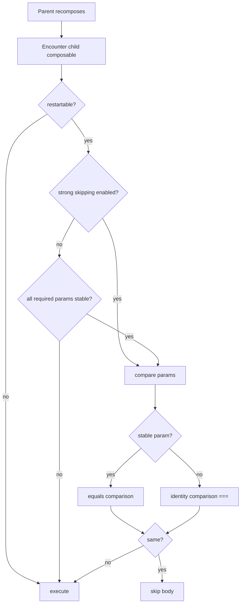

# Compose Stability Diagnostics 深度解析

对应 skill: [`compose-stability-diagnostics`](../skills/compose-stability-diagnostics/SKILL.md)

这一篇处理 Compose 性能里的第一条轴：

> 参数稳定性、skippability、compiler reports，以及 Kotlin 2.0.20+ strong skipping 下应该如何理解 unstable。

它和 [`compose-state-deferred-reads`](./compose-state-deferred-reads.md) 是互补关系：前者看参数能不能被跳过，后者看 State 读取是否发生在正确阶段。

## 核心原则

Compose 参数稳定性问题不是“报告里出现 unstable 就必须消灭”，而是：

> 输入在 recomposition 之间能否便宜、稳定、符合语义地比较。

在 Kotlin 2.0.20+ 中，strong skipping 默认启用。这个变化非常重要：

- restartable composable 即使有 unstable 参数，也可以 skippable，除非显式 opt out。
- stable 参数通常按 `equals` 比较。
- unstable 参数按 instance identity，也就是 `===` 比较。
- composable 内部 lambda 会基于 capture 自动 remember。

因此现代 Compose 下的问题从：

> unstable 参数会不会让 composable 完全不可跳过？

变成：

> 这个参数用 identity 比较是否符合预期？调用方是否每次都创建新 unstable 实例？

## Runtime 视角：stable vs unstable 比较

简化模型：



这张图是概念模型，不是 compiler/runtime 源码细节。它表达的是：strong skipping 下 unstable 仍然能参与 skipping，但比较语义是 identity。

## 什么时候 stability 真的重要

以下情况值得处理：

- Layout Inspector / trace 显示某个 expensive composable 频繁执行。
- compiler reports 显示关键 UI state 或参数 unstable。
- 调用方每次 recomposition 都创建新的 `List`、`Set`、`Map`、wrapper 或 lambda。
- 参数是第三方不可变类型，但 Compose 不知道它稳定。
- old compiler / strong skipping disabled，unstable 参数导致 non-skippable。

以下情况不值得过度处理：

- recomposition 对应真实数据变化。
- composable 很小，优化收益低。
- 为了报告干净而给不稳定类型乱加 `@Immutable`。
- 问题实际来自 scroll / animation State 在 composition 中读取。

## 生成 compiler reports

Kotlin 2.0+ 使用 Compose Compiler Gradle plugin 配置：

```kotlin
plugins {
    alias(libs.plugins.android.application)
    alias(libs.plugins.kotlin.android)
    alias(libs.plugins.compose.compiler)
}

if (providers.gradleProperty("composeReports").orNull == "true") {
    composeCompiler {
        reportsDestination = layout.buildDirectory.dir("compose_compiler")
        metricsDestination = layout.buildDirectory.dir("compose_compiler")
    }
}
```

构建你关心的 variant：

```bash
./gradlew :app:assembleRelease -PcomposeReports=true
```

关键文件：

| File | 用途 |
|---|---|
| `<module>-classes.txt` | 类和属性的 stability 信息 |
| `<module>-composables.txt` | composable 的 restartable / skippable 状态和参数 stability |
| `<module>-composables.csv` | 方便排序和批量分析 |
| `<module>-module.json` | 汇总指标 |

注意：runtime profiling 应尽量看 release / non-debuggable 构建。compiler reports 是 build-time 输出，关键是匹配你实际关心的 compiler 配置和 variant。

## 典型 unstable 来源

### Kotlin collection interfaces

```kotlin
data class FeedUiState(
    val items: List<FeedItemUi>,
    val selectedIds: Set<ItemId>,
)
```

`List` / `Set` / `Map` 是接口。Compose 无法知道 runtime 实现是否不可变。

更明确：

```kotlin
import kotlinx.collections.immutable.ImmutableList
import kotlinx.collections.immutable.ImmutableSet

data class FeedUiState(
    val items: ImmutableList<FeedItemUi>,
    val selectedIds: ImmutableSet<ItemId>,
)
```

在 producer 边界转换：

```kotlin
FeedUiState(
    items = items.toImmutableList(),
    selectedIds = selectedIds.toImmutableSet(),
)
```

不要在 composable body 中每次 `.toImmutableList()`，否则你可能修了 stability 又制造实例 churn。

### 第三方不可变类型

例如：

- `java.math.BigDecimal`
- `java.math.BigInteger`
- `java.time.*`
- `kotlinx.datetime.*`

如果它们在项目语义中确实不可变，可以使用 stability configuration：

```kotlin
composeCompiler {
    stabilityConfigurationFiles.add(
        rootProject.layout.projectDirectory.file("compose_stability.conf"),
    )
}
```

```text
java.math.BigDecimal
java.math.BigInteger
java.time.*
kotlinx.datetime.*
```

只列你愿意承诺不可变的类型。不要把 `java.util.Date` 这类可变类型放进去。

### UI state wrapper 每次新建

```kotlin
@Composable
fun Parent(rawItems: List<Item>) {
    Child(
        state = ChildState(
            items = rawItems.map { it.toUi() },
        ),
    )
}
```

如果 `Parent` 经常 recomposes，这里每次都会创建新 `ChildState` 和新 list。即使 strong skipping 开启，identity 比较也可能让 child 不能跳过。

修复方向取决于语义：

- 把 mapping 放到 ViewModel / state holder。
- 使用 stable immutable state。
- 对纯 UI 派生值使用 `remember(rawItems)`，前提是 rawItems identity / equality 语义正确。

## `@Immutable` 与 `@Stable`

### `@Immutable`

用于承诺：

- 所有 public observable property effectively immutable。
- `equals` 能描述全部可观察状态。
- 构造后不会从外部改变。

适合：

```kotlin
@Immutable
data class PriceUi(
    val amountText: String,
    val currency: String,
)
```

不适合：

```kotlin
@Immutable
class MutableBag(
    val items: MutableList<String>,
)
```

这是 false promise。Compose 可能跳过本应更新的 UI。

### `@Stable`

用于承诺：

- public property 的变化会被 Compose 观察到，或不会影响 UI。
- 方法在相同输入下结果稳定。
- 类型可能有内部 mutable state，但 mutation 对 Compose 可观察。

例如：

```kotlin
@Stable
class CounterState {
    var count by mutableStateOf(0)
        private set

    fun increment() {
        count++
    }
}
```

不要用 `@Stable` / `@Immutable` 只是为了消 report。注解是 contract，不是 suppression。

## Strong skipping 下的真实问题：instance churn

Kotlin 2.0.20+ strong skipping 并不意味着稳定性无关。

假设参数 unstable 且按 identity 比较：

```kotlin
Child(items = buildList { addAll(source) })
```

每次 recomposition 都是新实例：

```text
oldItems === newItems -> false
```

child 不能跳过。

如果参数 stable 且 equality 正确：

```text
oldItems == newItems -> true
```

child 可能跳过。

所以现代诊断重点是：

- 这个 unstable 参数 identity 是否稳定？
- 如果不稳定，它是否应该变成 stable / immutable / remembered？
- 如果 equality 比较很贵，是否反而应该避免大对象参数？

## 与 value class 的关系

单字段 domain wrapper 应优先考虑：

```kotlin
@JvmInline value class UserId(val value: String)
```

当 underlying type stable 时，value class 在 Compose 边界通常更友好：

- 有 domain type safety。
- 避免单字段 data class wrapper 分配。
- 不需要为了稳定性加 `@Immutable`。

详见：

[kotlin-types-value-class.md](./kotlin-types-value-class.md)

## 专家级审查清单

1. 项目是否 Kotlin 2.0.20+，strong skipping 是否启用？
2. 当前证据来自 compiler reports、Layout Inspector、trace，还是猜测？
3. suspicious composable 是否 expensive？
4. 参数 unstable 是否真的造成 instance churn？
5. collection 是否使用 `List` / `Set` / `Map` 接口暴露在 UI state 边界？
6. 第三方类型是否确实 immutable，是否适合 stability config？
7. `@Immutable` / `@Stable` 是否是真 contract，而不是 report suppression？
8. 修复是否改变了业务 equality 或序列化语义？
9. 问题是否其实是高频 State 读取阶段，而不是 stability？

## 精髓总结

1. Kotlin 2.0.20+ strong skipping 改变了 unstable 的含义，但没有让稳定性失效。
2. Stable 参数按 equality，unstable 参数按 identity；问题常在 instance churn。
3. Immutable collections 是 UI state 边界最常见的稳定性修复。
4. `@Immutable` / `@Stable` 是承诺，不是消警告工具。
5. Stability 诊断必须结合 runtime 证据，不要为 report cleanliness 做无意义重构。
