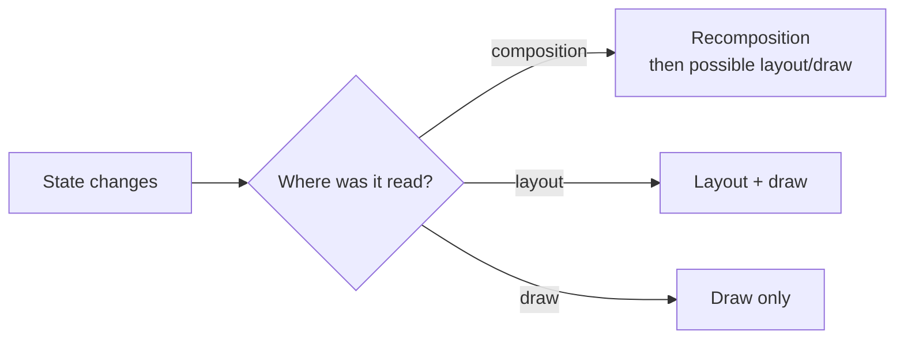

# Compose State Deferred Reads 深度解析

对应 skill: [`compose-state-deferred-reads`](../skills/compose-state-deferred-reads/SKILL.md)

这一篇处理 Compose 性能里的第二条轴：

> 高频 State 应该在哪个阶段读取：composition、layout，还是 draw？

它和 [`compose-stability-diagnostics`](./compose-stability-diagnostics.md) 互补。Stability 解决“参数能不能跳过”，deferred reads 解决“高频值是不是太早读了”。

## 核心原则

> State reads invalidate the phase that reads them.

含义：

- 在 composable body 中读 State，变化会使 composition 失效。
- 在 layout 阶段读 State，变化可以跳过 composition，只重新 layout / draw。
- 在 draw 阶段读 State，变化可以跳过 composition 和 layout，只重新 draw。

这对 frame-rate state 很关键。

Frame-rate state 包括：

- scroll offset。
- animation value。
- gesture / drag position。
- pointer position。
- fling / decay motion。
- 每帧变化的 visual progress。

这些状态通常不应该在大型 composable 的 composition 阶段读取。

## 阶段模型



目标不是“不读 State”，而是：

> 在最晚、最小、最符合用途的阶段读取。

## 典型错误：`by` 提前读取

错误：

```kotlin
@Composable
fun SelectionPill(selectedIndex: Int) {
    val offsetX by animateDpAsState(
        targetValue = 120.dp * selectedIndex,
        label = "pill-offset",
    )

    Box(Modifier.offset(x = offsetX))
}
```

`by` delegate 读取了 `State.value`。这个读取发生在 composition 阶段。动画每帧更新，就会每帧 invalidating composition。

改法：

```kotlin
@Composable
fun SelectionPill(selectedIndex: Int) {
    val offsetX = animateDpAsState(
        targetValue = 120.dp * selectedIndex,
        label = "pill-offset",
    )

    Box(
        Modifier.offset {
            IntOffset(offsetX.value.roundToPx(), 0)
        },
    )
}
```

这里保留 `State<Dp>`，把 `.value` 读取移到 `Modifier.offset { ... }` 的 layout callback 里。

关键变化：

```kotlin
val offsetX by animateDpAsState(...)
```

变为：

```kotlin
val offsetX = animateDpAsState(...)
```

不是语法偏好，而是读阶段变化。

## Value-form modifier vs block-form modifier

很多 modifier 有两种形态。

### Value form

```kotlin
Modifier.graphicsLayer(translationY = y)
```

`y` 必须已经在 composition 中算好，因此如果它来自 State，就已经被读了。

### Block form

```kotlin
Modifier.graphicsLayer {
    translationY = yProvider()
}
```

block 在 layer/draw 相关阶段执行，可以把读取推迟。

常见替换：

| Composition read | Deferred read |
|---|---|
| `Modifier.offset(x = animatedX)` | `Modifier.offset { IntOffset(animatedX.value.roundToPx(), 0) }` |
| `Modifier.graphicsLayer(translationY = y)` | `Modifier.graphicsLayer { translationY = yProvider() }` |
| `val color by animateColorAsState(...); Modifier.background(color)` | `val color = animateColorAsState(...); drawBehind { drawRect(color.value) }` |
| `val radius by animateFloatAsState(...); drawBehind { drawCircle(radius = radius) }` | `val radius = animateFloatAsState(...); drawBehind { drawCircle(radius = radius.value) }` |

注意：`drawBehind` 本身是 draw-phase block，但如果你在 block 外用 `by` 先读了值，仍然会 composition read。

## 跨 composable boundary 的 provider

错误：

```kotlin
@Composable
fun HomeScreen() {
    val listState = rememberLazyListState()

    LazyColumn(state = listState) {
        item {
            HeroImage(
                scrollOffset = listState.firstVisibleItemScrollOffset,
            )
        }
    }
}

@Composable
fun HeroImage(scrollOffset: Int) {
    AsyncImage(
        model = "...",
        contentDescription = null,
        modifier = Modifier.graphicsLayer(
            translationY = -scrollOffset / 2f,
        ),
    )
}
```

`HomeScreen` 在 composition 中读取 scroll offset，并把普通 `Int` 传给 child。滚动时 parent composition 失效。

改为 provider：

```kotlin
@Composable
fun HomeScreen() {
    val listState = rememberLazyListState()

    LazyColumn(state = listState) {
        item {
            HeroImage(
                scrollOffsetProvider = {
                    if (listState.firstVisibleItemIndex == 0) {
                        listState.firstVisibleItemScrollOffset
                    } else {
                        0
                    }
                },
            )
        }
    }
}

@Composable
fun HeroImage(
    scrollOffsetProvider: () -> Int,
    modifier: Modifier = Modifier,
) {
    AsyncImage(
        model = "...",
        contentDescription = null,
        modifier = modifier.graphicsLayer {
            translationY = -scrollOffsetProvider() / 2f
        },
    )
}
```

`Provider` suffix 是有意义的：它告诉调用者这个 lambda 是 deferred-read contract，不是普通 callback。

## 可以 defer 的地方

State reads 可以推迟到：

- `Modifier.offset { ... }`
- `Modifier.graphicsLayer { ... }`
- `Modifier.layout { measurable, constraints -> ... }`
- `drawBehind { ... }`
- `drawWithContent { ... }`
- custom `Alignment.align(...)`
- 其他 layout / draw callback

选择原则：

- 只影响位置：layout / placement。
- 只影响绘制：draw。
- 影响是否存在、哪个 composable 存在：composition。

## 什么时候不能 defer

如果 State 决定 UI 结构，就必须在 composition 读。

例如：

```kotlin
if (expanded) {
    Details()
}
```

`expanded` 决定是否 emit `Details()`。这就是 composition 决策。

再例如：

```kotlin
when (state) {
    Loading -> LoadingUi()
    Content -> ContentUi()
    Error -> ErrorUi()
}
```

这也属于 composition。

不要为了“减少 recomposition”把结构性状态塞进 draw lambda。那会破坏 UI 模型。

## 与动画的关系

`animate*AsState` 返回 `State<T>`，这个 State 在动画期间频繁更新。

如果动画值用于：

- alpha / translation / scale；
- offset；
- draw color；
- draw radius；
- parallax；

优先考虑 deferred read。

如果动画值决定：

- 展示哪个 composable；
- 哪个 branch 存在；
- slot 内容切换；

composition read 是合理的，或者应该使用 `AnimatedVisibility` / `AnimatedContent`。

## 与 modifier API 设计的关系

Child composable 必须有正常 `modifier` 参数，caller 才能把 deferred read 放到合适位置。

错误：

```kotlin
@Composable
fun HeroImage(scrollOffset: Int) {
    AsyncImage(
        model = "...",
        modifier = Modifier.graphicsLayer(
            translationY = -scrollOffset / 2f,
        ),
    )
}
```

更灵活：

```kotlin
@Composable
fun HeroImage(modifier: Modifier = Modifier) {
    AsyncImage(
        model = "...",
        modifier = modifier,
    )
}
```

调用方：

```kotlin
HeroImage(
    modifier = Modifier.graphicsLayer {
        translationY = -listState.firstVisibleItemScrollOffset / 2f
    },
)
```

这和 [`compose-modifier-and-layout-style`](./compose-modifier-and-layout-style.md) 直接相关。

## 常见错误

### 错误一：`by` 读了动画值

```kotlin
val alpha by animateFloatAsState(targetValue = target)
Box(Modifier.graphicsLayer(alpha = alpha))
```

修复：

```kotlin
val alpha = animateFloatAsState(targetValue = target)
Box(Modifier.graphicsLayer { this.alpha = alpha.value })
```

### 错误二：draw block 外提前读

```kotlin
val color by animateColorAsState(targetColor)
Canvas(Modifier.drawBehind { drawRect(color) })
```

修复：

```kotlin
val color = animateColorAsState(targetColor)
Canvas(Modifier.drawBehind { drawRect(color.value) })
```

### 错误三：高频 value 跨 boundary

```kotlin
Child(progress = animationProgress)
```

如果 `progress` 每帧变化且只影响 draw/layout，考虑：

```kotlin
Child(progressProvider = { animationProgressState.value })
```

或者把 modifier 传入 child。

### 错误四：该 composition 的状态被强行 defer

```kotlin
drawBehind {
    if (expanded) {
        // draw fake details instead of emitting real content
    }
}
```

如果 `expanded` 决定真实 UI 结构、语义、可访问性、输入区域，就应该留在 composition。

## 专家级审查清单

1. 这个 State 是否 frame-rate 变化？
2. 它是否在 composable body 中通过 `by` 或 `.value` 被读取？
3. 它是否只是影响位置、layer、alpha、绘制？
4. 是否有 block-form modifier 可以替代 value-form modifier？
5. 高频值是否以普通参数跨 composable boundary？
6. 是否应该传 provider lambda 或 modifier，而不是 value？
7. State 是否决定 UI 结构？如果是，不要 defer。
8. 修改后是否用 recomposition counter / trace 验证效果？

## 精髓总结

1. State 在哪个阶段被读，就 invalidates 哪个阶段。
2. Scroll、animation、gesture 这类高频值通常不该在 composition 中读。
3. 保留 `State<T>` 或 provider lambda，把 `.value` 读取移到 layout/draw callback。
4. 如果状态决定 UI 结构，composition read 是正确的。
5. Deferred reads 是结构性优化，不是语法微调。
