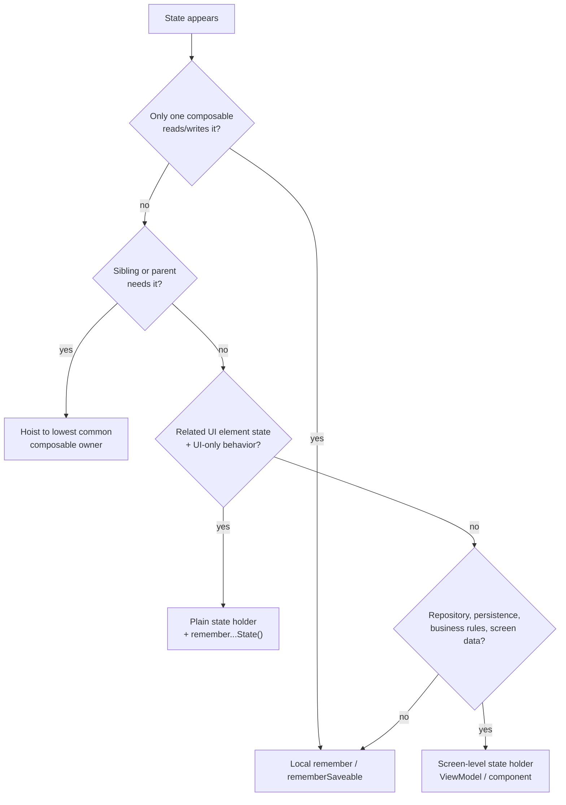
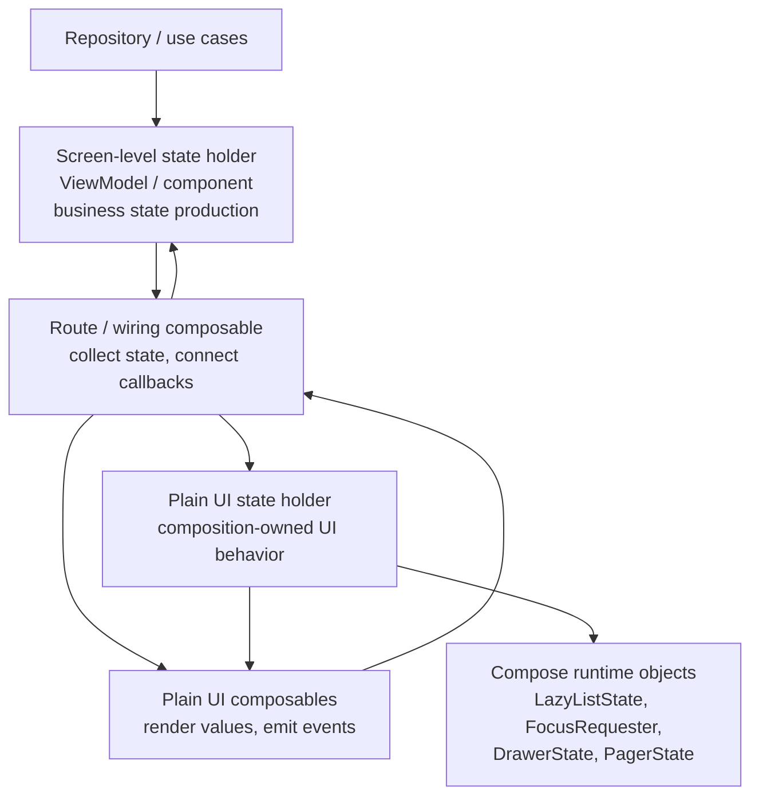

# Compose State Hoisting 深度解析

对应 skill: [`compose-state-hoisting`](../skills/compose-state-hoisting/SKILL.md)

上一节 [`compose-state-authoring`](./compose-state-authoring.md) 解决的是：

> 一个状态怎么写，才能 survive recomposition，并且被 Compose 正确观察？

这一节解决的是更架构化的问题：

> 这个状态应该归谁拥有？

一个状态即使写法完全正确，也可能 owner 放错。owner 放错之后，代码会出现这些问题：

- 子组件知道了不该知道的业务逻辑。
- 父组件被迫管理大量无意义 UI 细节。
- ViewModel 里塞进 `LazyListState`、`FocusRequester`、drawer animation 这种 composition-owned 对象。
- Preview 和测试很难写。
- 状态同步靠回调链硬连，最后变成“哪里都能改，哪里都不知道为什么改”。

`compose-state-hoisting` 的核心原则是：

> Hoist state only as far as the logic needs it.

也就是：状态只上提到真正需要读写它、协调它、或承载相关业务规则的最低 owner。

这不是“所有 state 都上提到 ViewModel”，也不是“所有 UI state 都留在 composable 里”。真正的判断依据是：

- 谁读这个状态？
- 谁写这个状态？
- 谁需要协调它和其他状态？
- 谁承载和它相关的业务规则？

## UI element state 与 screen UI state

Compose 状态架构里最重要的分界，是区分 **UI element state** 和 **screen UI state**。

### UI element state

UI element state 是 UI 控件或局部交互需要的状态。

例如：

```kotlin
var expanded by remember { mutableStateOf(false) }
var selectedTab by rememberSaveable { mutableStateOf(Tab.Home) }
val listState = rememberLazyListState()
val focusRequester = remember { FocusRequester() }
var sheetOpen by remember { mutableStateOf(false) }
```

它们描述的是 UI 元素当前怎么表现、怎么交互：

- 是否展开。
- sheet 是否打开。
- 当前 tab。
- 文本框编辑中的内容。
- scroll position。
- focus state。
- selection。
- animation / interaction state。

这些状态不一定属于 ViewModel。

### Screen UI state

Screen UI state 是业务数据经过加工后，给屏幕展示的状态。

例如：

```kotlin
data class ProductSearchUiState(
    val products: List<ProductUi>,
    val isLoading: Boolean,
    val errorMessage: String?,
    val selectedFilterIds: Set<FilterId>,
)
```

它通常来自：

- repository。
- database。
- network。
- use case。
- domain state。
- screen-level business logic。

这类状态通常属于 screen-level state holder，比如 ViewModel、Presenter、Component。

关键区别：

> UI element state 关心控件怎么工作。Screen UI state 关心页面展示什么业务数据。

这个分界不是按类型分，而是按语义分。

同样是 `query: String`，可能有两种归属。

如果只是本地输入框临时内容：

```kotlin
var query by rememberSaveable { mutableStateOf("") }
```

可以留在 UI。

如果 `query` 驱动 repository-backed suggestions：

```kotlin
viewModel.updateQuery(query)
```

那它就是业务状态生产链路的一部分，应该归 ViewModel 或 screen state holder。

## 状态 owner 的四级决策

这个 skill 给出的是一个四级 owner 模型：



### 第一级：一个 composable 自己读写，留本地

如果只有一个 composable 需要这个状态，而且逻辑很简单，留在本地。

```kotlin
@Composable
fun ExpandableCard() {
    var expanded by rememberSaveable { mutableStateOf(false) }

    Card(onClick = { expanded = !expanded }) {
        Header()
        if (expanded) {
            Details()
        }
    }
}
```

这时候上提没有价值。

过度 hoisting：

```kotlin
@Composable
fun Screen() {
    var expanded by rememberSaveable { mutableStateOf(false) }

    ExpandableCard(
        expanded = expanded,
        onExpandedChange = { expanded = it },
    )
}
```

如果 `Screen` 不关心 `expanded`，只是中转，那就是过度 hoisting。父组件被迫知道子组件内部细节，API 噪声增加，复用性反而下降。

判断标准：

> 如果 parent 不读、不写、不协调这个状态，就不要上提给 parent。

### 第二级：多个 sibling/parent 需要协调，上提到最低共同祖先

如果一个状态影响多个兄弟组件，就上提到它们的 lowest common owner。

例如搜索框和列表都需要 `query`：

```kotlin
@Composable
fun SearchScreen() {
    var query by rememberSaveable { mutableStateOf("") }

    Column {
        SearchField(
            query = query,
            onQueryChange = { query = it },
        )

        ProductList(
            query = query,
        )
    }
}
```

这里 `query` 不能放在 `SearchField` 内部，因为 `ProductList` 也需要它。

但也不一定要放 ViewModel。若过滤只是本地 UI filtering，没有 repository、没有持久化、没有业务规则，放在最低共同 composable 就够了。

专家判断：

> 共享不等于 ViewModel。共享只说明它要上提到最低共同 owner。

### 第三级：UI-only 行为变复杂，抽 plain state holder

当一个 composable 内部有多个相关 UI element state，它们互相协调，逻辑开始影响可读性、测试和 preview，就应该抽 plain state holder。

例如：

```kotlin
@Stable
class ProductSearchState(
    query: String,
    private val listState: LazyListState,
    private val focusRequester: FocusRequester,
) {
    var query by mutableStateOf(query)
        private set

    var filtersOpen by mutableStateOf(false)
        private set

    val canClear: Boolean
        get() = query.isNotEmpty()

    fun updateQuery(value: String) {
        query = value
    }

    fun clear() {
        query = ""
        focusRequester.requestFocus()
    }

    suspend fun jumpToTop() {
        listState.animateScrollToItem(0)
    }
}
```

对应的 remember factory：

```kotlin
@Composable
fun rememberProductSearchState(
    initialQuery: String = "",
    listState: LazyListState = rememberLazyListState(),
    focusRequester: FocusRequester = remember { FocusRequester() },
): ProductSearchState {
    return remember(listState, focusRequester) {
        ProductSearchState(initialQuery, listState, focusRequester)
    }
}
```

这类 state holder 不是 ViewModel。它是 composition-owned UI behavior object。

适合放：

- `LazyListState`。
- `FocusRequester`。
- `PagerState`。
- `DrawerState`。
- `TextFieldState`。
- sheet state。
- UI-only derived flags。
- UI 操作方法，比如 `clear()`、`jumpToTop()`、`openFilters()`。

不适合放：

- repository 调用。
- domain rule。
- persistence。
- analytics 规则。
- 权限业务决策。
- screen data loading。

一句话：

> Plain state holder 管 UI 机制，ViewModel 管业务状态生产。

### 第四级：涉及业务逻辑、持久化、repository，用 screen-level state holder

一旦状态参与业务数据生产，就不要只留在 composable 或 plain state holder 里。

例如：

```kotlin
class ProductSearchViewModel(
    private val repository: ProductRepository,
) : ViewModel() {
    private val query = MutableStateFlow("")

    val uiState: StateFlow<ProductSearchUiState> =
        query
            .debounce(300)
            .flatMapLatest { repository.searchProducts(it) }
            .map { products -> ProductSearchUiState(products = products) }
            .stateIn(
                viewModelScope,
                SharingStarted.WhileSubscribed(5_000),
                ProductSearchUiState.Empty,
            )

    fun updateQuery(value: String) {
        query.value = value
    }
}
```

这时 `query` 虽然来自 `TextField`，但它已经是 repository search 的输入。它不是纯 UI element state，而是 screen state production 的一部分。

UI 层只负责渲染：

```kotlin
@Composable
fun ProductSearchRoute(
    viewModel: ProductSearchViewModel,
) {
    val state by viewModel.uiState.collectAsStateWithLifecycle()

    ProductSearchScreen(
        state = state,
        onQueryChange = viewModel::updateQuery,
    )
}
```

## Hoisting 的本质是定义读写协议

很多人把 state hoisting 理解成：

```kotlin
value: T,
onValueChange: (T) -> Unit
```

这只是最简单的形式。

真正的 state hoisting 是把状态所有权和 mutation protocol 明确化。

低级 API：

```kotlin
TextField(
    value = query,
    onValueChange = onQueryChange,
)
```

这适合直接暴露值变更。

但复杂行为更适合 intent-style callback：

```kotlin
SearchField(
    query = state.query,
    canClear = state.canClear,
    onQueryChange = state::updateQuery,
    onClear = state::clear,
    onSubmit = state::submit,
)
```

不要盲目把所有变化都暴露成 setter。

例如：

```kotlin
onFiltersOpenChange: (Boolean) -> Unit
```

有时不如：

```kotlin
onOpenFilters: () -> Unit
onDismissFilters: () -> Unit
```

因为后者表达的是用户意图，不是任意修改权限。

专家判断：

> Hoisting 后暴露的 callback 应该表达调用方允许 child 发起的意图，而不是把内部状态裸露给 child 随便改。

## Plain state holder 的真正价值

Plain state holder 不是为了让代码看起来更“有架构”。它解决的是 composable 内部 UI 逻辑开始形成一个独立概念。

触发信号包括：

- 多个 `remember` 状态由同一组 callbacks 协调。
- scroll、focus、sheet、text、selection 之间存在联动。
- 有命名操作，比如 `clear()`、`submit()`、`jumpToTop()`、`openFilters()`。
- derived UI flags 到处散落。
- child 收到很多它不该理解的机械细节。
- preview / test 为了测一个行为要搭一长串状态。
- helper 函数传参越来越多，只是为了让 composable 不爆炸。

例如一个 screen 里出现：

```kotlin
val listState = rememberLazyListState()
val focusRequester = remember { FocusRequester() }
var query by rememberSaveable { mutableStateOf("") }
var filtersOpen by remember { mutableStateOf(false) }
var selectedFilterIds by rememberSaveable { mutableStateOf(emptySet<FilterId>()) }

val canClear = query.isNotBlank()
val showJumpToTop = listState.firstVisibleItemIndex > 0

fun clear() {
    query = ""
    focusRequester.requestFocus()
}
```

这时 composable 已经不只是“渲染 UI”，它在管理一个搜索面板行为。抽成 `ProductSearchState` 会更清晰。

但如果只有：

```kotlin
var expanded by remember { mutableStateOf(false) }
```

就不要抽 holder。那是 ceremony，不是 separation of concerns。

## Composition-owned 对象不要塞进 ViewModel

这些对象通常应该跟 composition lifecycle 绑定：

- `LazyListState`。
- `ScrollState`。
- `FocusRequester`。
- `PagerState`。
- `DrawerState`。
- `SnackbarHostState`。
- `TextFieldState`。
- coroutine scope from `rememberCoroutineScope`。

原因：

1. 它们通常依赖 Compose runtime、frame clock 或 UI tree。
2. 它们的生命周期和屏幕 composition 更接近。
3. 它们不是业务状态。
4. ViewModel 不应该持有 UI runtime 对象。

尤其是 suspend UI operation：

```kotlin
scope.launch {
    listState.animateScrollToItem(0)
}
```

这个 `scope` 应该是 composition-scoped：

```kotlin
val scope = rememberCoroutineScope()
```

而不是：

```kotlin
viewModelScope.launch {
    listState.animateScrollToItem(0)
}
```

`viewModelScope` 管业务协程，不应该驱动 Compose UI animation。动画需要 frame clock，语义也属于 UI 层。

ViewModel 可以发出“需要滚到顶部”的事件或状态，但真正调用 `animateScrollToItem` 的地方应该在 UI composition scope。

## 保存状态：保存最小可恢复值

`rememberSaveable` 或 `Saver` 用来保存可以序列化、可恢复的最小状态。

应该保存：

```kotlin
query: String
selectedFilterIds: Set<String>
selectedTabKey: String
```

不要保存：

```kotlin
LazyListState
FocusRequester
CoroutineScope
callbacks
Repository
```

如果一个 plain state holder 里有 runtime object，应该为它设计 `Saver` 时只保存可恢复值：

```kotlin
data class SavedSearchState(
    val query: String,
    val selectedFilterIds: Set<String>,
)
```

恢复时重新创建 composition-owned 对象：

```kotlin
val listState = rememberLazyListState()
val focusRequester = remember { FocusRequester() }
val state = rememberProductSearchState(
    initialQuery = savedQuery,
    listState = listState,
    focusRequester = focusRequester,
)
```

专家原则：

> 保存状态不是序列化整个对象图，而是保存足够重建 UI 行为的最小事实。

## 状态 owner 关系图



这个图表达的是职责流向：

- Repository / use case 产生业务数据。
- ViewModel / component 生产 screen UI state。
- Route / wiring composable 连接 ViewModel、plain UI state holder 和 UI。
- Plain state holder 管 UI element state 与 UI-only 操作。
- Plain UI composable 渲染值并发出事件。

## 常见错误模式

### 错误一：所有 state 都上提

```kotlin
@Composable
fun Parent() {
    var dropdownExpanded by remember { mutableStateOf(false) }

    ChildDropdown(
        expanded = dropdownExpanded,
        onExpandedChange = { dropdownExpanded = it },
    )
}
```

如果 parent 不关心 dropdown 是否展开，这就是噪声。留在 `ChildDropdown` 内部即可。

### 错误二：所有 state 都进 ViewModel

```kotlin
class ScreenViewModel : ViewModel() {
    var sheetOpen by mutableStateOf(false)
    lateinit var listState: LazyListState
}
```

这把 UI runtime 对象和业务 state holder 混在一起了。

### 错误三：UI holder 变成 screen dump

```kotlin
class ScreenState {
    var query by mutableStateOf("")
    var products by mutableStateOf(emptyList<Product>())
    var error by mutableStateOf(null)
    val listState = LazyListState()
    fun loadProducts() { ... }
}
```

这既像 ViewModel，又像 UI holder，边界不清。应该拆：

- ViewModel 负责 `products` / `error` / `loading` / `query search`。
- Plain state holder 负责 `listState` / `focus` / `sheet` / local UI commands。

### 错误四：child 收到它不该拥有的 holder

```kotlin
FilterButton(searchState: ProductSearchState)
```

如果 `FilterButton` 只需要知道是否启用和点击事件，就传：

```kotlin
FilterButton(
    enabled = state.canOpenFilters,
    onClick = state::openFilters,
)
```

不要把整个 holder 传深，除非 child 真的是这个 holder 行为的一部分。

## 专家级审查清单

审查 Compose 状态 owner 时，可以按这个顺序问：

1. 这个状态是否只有一个 composable 自己用？如果是，优先 local `remember` / `rememberSaveable`。
2. 是否只是几个 sibling / parent 共享的 UI element state？如果是，上提到最低共同 composable owner。
3. 是否是多个相关 UI element state 加 UI-only 操作？如果是，抽 plain state holder。
4. 是否涉及 repository、持久化、业务规则、screen data production？如果是，放到 screen-level state holder。
5. 这个 UI element state 是否是业务逻辑输入？如果是，它应该跟随业务逻辑 owner。
6. 是否把 composition-owned 对象塞进了 ViewModel？如果是，通常应该移回 composition 或 plain state holder。
7. 是否把整个 holder 传给了不相关 child？如果是，改传 plain values 和 callbacks。
8. 是否为了一个 boolean 抽了 state holder？如果是，大概率过度设计。

## 精髓总结

`compose-state-hoisting` 不是鼓励“越上越好”，而是要求状态 owner 精准。

可以压缩成四句话：

1. 只在需要协调的地方上提。一个 composable 自己用的简单 UI state，留本地。
2. 共享状态上提到最低共同 owner。Sibling 共享不等于 ViewModel。
3. UI 机制复杂时抽 plain state holder。它属于 composition，不属于业务层。
4. 业务数据生产归 screen state holder。Repository、持久化、业务规则、screen UI state 不要塞进 composable local state 或 UI holder。
