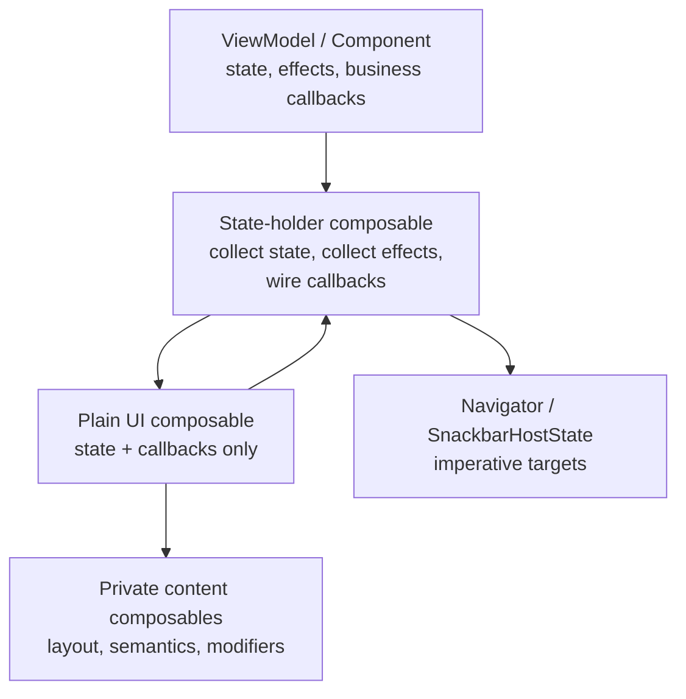

# Compose State Holder / UI Split 深度解析

对应 skill: [`compose-state-holder-ui-split`](../skills/compose-state-holder-ui-split/SKILL.md)

前两篇文档分别解决了两个问题：

- [`compose-state-authoring`](./compose-state-authoring.md)：一个状态怎么写，才能 survive recomposition，并且被 Compose 正确观察。
- [`compose-state-hoisting`](./compose-state-hoisting.md)：这个状态应该归谁拥有。

这一篇解决的是屏幕级 Compose 代码最常见的结构问题：

> 如何把 state holder wiring 和 UI rendering 拆开？

这里的 split 不是为了追求形式上的分层，而是为了让屏幕代码同时满足：

- UI 可以 preview。
- UI 可以用纯 state 测试。
- ViewModel / component / DI / navigation 不泄漏到整个 composable tree。
- side effects 的生命周期清晰。
- Android、Desktop、TV、KMP / CMP 目标更容易复用同一套 UI。

## 核心原则

`compose-state-holder-ui-split` 的核心原则是：

> Separate state-holder wiring from UI rendering.

也就是：

- **State-holder composable** 负责和 ViewModel、component、Flow、lifecycle、navigation、snackbar、effect stream、DI 对接。
- **UI composable** 只接收 plain immutable UI state 和 callbacks，然后描述 layout。

概念图：



这个图的关键是：UI 可以向上发出用户意图，但不直接持有 ViewModel、component、navigator 或 repository。

## 反例：一个函数同时做 wiring 和 layout

常见问题代码：

```kotlin
@Composable
fun ProfileScreen(
    viewModel: ProfileViewModel,
    navigator: Navigator,
) {
    val state by viewModel.state.collectAsStateWithLifecycle()
    val snackbarHostState = remember { SnackbarHostState() }

    LaunchedEffect(viewModel) {
        viewModel.effects.collect { effect ->
            when (effect) {
                ProfileEffect.Saved -> snackbarHostState.showSnackbar("Saved")
                ProfileEffect.GoBack -> navigator.pop()
            }
        }
    }

    Scaffold(
        snackbarHost = { SnackbarHost(snackbarHostState) },
        topBar = {
            TopAppBar(
                title = { Text("Profile") },
                navigationIcon = {
                    IconButton(onClick = navigator::pop) {
                        Icon(Icons.AutoMirrored.Default.ArrowBack, contentDescription = null)
                    }
                },
            )
        },
    ) { padding ->
        Column(Modifier.padding(padding)) {
            TextField(
                value = state.name,
                onValueChange = viewModel::onNameChange,
            )

            Button(
                enabled = state.canSave,
                onClick = viewModel::save,
            ) {
                Text(if (state.isSaving) "Saving" else "Save")
            }
        }
    }
}
```

这段代码能工作，但结构上有明显问题：

- Preview 必须构造 `ProfileViewModel`、`Navigator`，甚至 DI 和 lifecycle。
- UI test 如果只想验证 `Save` button disabled，也要准备完整 app stack。
- Layout、state collection、effect collection、navigation 全在一个函数里。
- 子 UI 很容易继续拿到 `viewModel` 或 `navigator`，依赖向下泄漏。
- 如果以后要在 Desktop / KMP 复用 UI，Android lifecycle 和 navigation 会变成阻碍。

## 正确结构：State-holder composable + Plain UI composable

### State-holder composable

State-holder composable 是屏幕对外的 wiring 入口。

```kotlin
@Composable
fun ProfileScreen(
    component: ProfileComponent,
    navigator: Navigator,
    modifier: Modifier = Modifier,
) {
    val state by component.state.collectAsStateWithLifecycle()
    val snackbarHostState = remember { SnackbarHostState() }

    ProfileEffects(
        component = component,
        snackbarHostState = snackbarHostState,
        onBack = navigator::pop,
    )

    ProfileScreen(
        state = state,
        snackbarHostState = snackbarHostState,
        onNameChange = component::onNameChange,
        onSaveClick = component::save,
        onBackClick = navigator::pop,
        modifier = modifier,
    )
}
```

它负责：

- 收集 ViewModel / component 的 screen state。
- 收集 one-shot effects。
- 连接 imperative targets，例如 navigator、snackbar、permission launcher。
- 把 state holder 的方法映射成 UI callbacks。
- 初始化必要的 top-level UI runtime object，例如 `SnackbarHostState`。

它不应该负责大量 layout。

### Effect handler

Effect handling 适合靠近 state holder，因为 effect source 和 imperative target 都在这里。

```kotlin
@Composable
private fun ProfileEffects(
    component: ProfileComponent,
    snackbarHostState: SnackbarHostState,
    onBack: () -> Unit,
) {
    LaunchedEffect(component, snackbarHostState, onBack) {
        component.effects.collect { effect ->
            when (effect) {
                ProfileEffect.Saved -> snackbarHostState.showSnackbar("Saved")
                ProfileEffect.GoBack -> onBack()
            }
        }
    }
}
```

如果 effect handling 很小，可以直接放在 state-holder composable 里。如果它开始变长，抽成 sibling effect handler，而不是把 component 传进 UI composable。

注意：effect key 必须表达 effect lifecycle。上例中 collection 跟随 `component`，snackbar target 跟随 `snackbarHostState`。如果 `onBack` 可能变化且你不想重启 collection，可以使用 `rememberUpdatedState`，具体属于 [`compose-side-effects`](../skills/compose-side-effects/SKILL.md) 的范围。

### Plain UI composable

UI composable 不知道 ViewModel / component / navigator。

```kotlin
@Composable
fun ProfileScreen(
    state: ProfileUiState,
    snackbarHostState: SnackbarHostState,
    onNameChange: (String) -> Unit,
    onSaveClick: () -> Unit,
    onBackClick: () -> Unit,
    modifier: Modifier = Modifier,
) {
    Scaffold(
        modifier = modifier,
        snackbarHost = { SnackbarHost(snackbarHostState) },
        topBar = {
            ProfileTopBar(onBackClick = onBackClick)
        },
    ) { padding ->
        ProfileContent(
            name = state.name,
            isSaving = state.isSaving,
            canSave = state.canSave,
            onNameChange = onNameChange,
            onSaveClick = onSaveClick,
            modifier = Modifier.padding(padding),
        )
    }
}
```

它负责：

- 渲染 immutable UI state。
- 暴露用户意图 callbacks。
- 管 layout、modifier、semantics、test tags。
- 管只属于 UI 行为的 local state，例如 scroll、focus、animation、interaction。

### Private content composable

大的 UI composable 可以继续拆私有 content 函数：

```kotlin
@Composable
private fun ProfileContent(
    name: String,
    isSaving: Boolean,
    canSave: Boolean,
    onNameChange: (String) -> Unit,
    onSaveClick: () -> Unit,
    modifier: Modifier = Modifier,
) {
    Column(modifier) {
        TextField(
            value = name,
            onValueChange = onNameChange,
        )

        Button(
            enabled = canSave && !isSaving,
            onClick = onSaveClick,
        ) {
            Text(if (isSaving) "Saving" else "Save")
        }
    }
}
```

Private content 函数不是新的 state holder 层。它只是拆 layout，让主要 UI contract 更清楚。

## 职责矩阵

| Concern | State-holder composable | UI composable |
|---|---|---|
| 接收 ViewModel / component / controller | 是 | 否 |
| 收集 business state Flow | 是 | 否 |
| 收集 one-shot effects | 是，或 tiny sibling effect handler | 通常否 |
| 持有 DI 对象、repository、service | 是，或由上层传入 | 否 |
| 接收 immutable UI state | 通常透传 | 是 |
| 接收用户事件 lambdas | 负责 wiring | 负责调用 |
| navigation / snackbar / permission launcher | 是 | 只通过 callback 表达意图 |
| layout、modifier、semantics、test tags | 最少 | 是 |
| UI-local state | 有时 seed 或创建 top-level host state | 是 |
| Preview / screenshot | 不一定友好 | 应该友好 |

## “UI composable 不收集 state” 的准确边界

这条规则经常被误解。

不推荐 UI composable 收集的是：

- ViewModel / component 的 app state。
- repository / use case Flow。
- one-shot effect stream。
- navigation event stream。
- 需要 lifecycle-aware collection 的 screen data。

但 plain UI composable 可以拥有 UI-local framework state：

```kotlin
@Composable
fun MessageList(
    messages: List<MessageUi>,
    onMessageClick: (MessageId) -> Unit,
    modifier: Modifier = Modifier,
) {
    val listState = rememberLazyListState()

    LazyColumn(
        state = listState,
        modifier = modifier,
    ) {
        items(
            items = messages,
            key = { it.id },
        ) { message ->
            MessageRow(
                message = message,
                onClick = { onMessageClick(message.id) },
            )
        }
    }
}
```

这没有违反 split。`LazyListState` 是 UI element state，和 rendered widget 的行为绑定。

同样可以出现在 UI composable 里的还有：

- `rememberScrollState`
- `rememberLazyListState`
- `FocusRequester`
- focus state
- animation state
- `TextFieldState`
- `MutableInteractionSource.collectIsPressedAsState()`
- hover / pressed / focused interaction state

如果这些 UI-local state 发展成多个相关字段和命名操作，就回到 [`compose-state-hoisting`](./compose-state-hoisting.md) 的判断：是否需要抽 plain state holder。

## 什么应该传给 UI composable

### 传最小有用 UI contract

对于真实屏幕，通常传 dedicated `UiState`：

```kotlin
data class ProfileUiState(
    val name: String,
    val isSaving: Boolean,
    val canSave: Boolean,
    val avatarUrl: String?,
)
```

然后 UI composable 接收：

```kotlin
@Composable
fun ProfileScreen(
    state: ProfileUiState,
    onNameChange: (String) -> Unit,
    onSaveClick: () -> Unit,
    onBackClick: () -> Unit,
    modifier: Modifier = Modifier,
)
```

这比传一长串无关联 primitive 更稳定，也更利于 preview。

### 不要把整个 component 传进 child

错误：

```kotlin
@Composable
fun ProfileContent(component: ProfileComponent) {
    TextField(
        value = component.state.value.name,
        onValueChange = component::onNameChange,
    )
}
```

问题：

- child 现在知道整个 component。
- child 可以调用它不该调用的方法。
- preview 需要 fake component。
- 测试 simple layout branch 也要构造 state holder。

正确：

```kotlin
@Composable
fun ProfileContent(
    name: String,
    onNameChange: (String) -> Unit,
)
```

### Navigation 传 callback，不传 route / navigator

UI composable 应该表达用户意图：

```kotlin
onBackClick()
onItemClick(item.id)
onRetryClick()
```

而不是直接：

```kotlin
navigator.navigate("profile/${item.id}")
```

因为 route 是 app navigation policy，不是 layout 的职责。

State-holder composable 可以把用户意图接到真实 navigation：

```kotlin
ProfileScreen(
    state = state,
    onBackClick = navigator::pop,
    onItemClick = { id -> navigator.openProfile(id) },
)
```

### Domain model 是否能传给 UI

不是绝对不能传 domain model，但要看它是否会把业务规则拖进 UI。

如果 UI 只展示字段，并且 domain model 本身就是稳定、简单、无业务行为的数据，传入可能可以接受。

但以下情况应该 map 成 UI model：

- UI 需要组合多个 domain source。
- UI 需要 formatted text、display state、enabled state。
- domain model 有复杂行为或业务含义，UI 不应该知道。
- domain model 不稳定或过大，影响 Compose skipping。
- KMP / 多端 UI 需要和平台/domain 解耦。

示例：

```kotlin
data class ProductUi(
    val id: ProductId,
    val title: String,
    val priceText: String,
    val availabilityLabel: String,
    val canBuy: Boolean,
)
```

UI 渲染 `ProductUi`，业务层决定 `canBuy` 和文案。

## 同名 overload 不是强制模板

skill 示例里有两个同名函数：

```kotlin
@Composable
fun ProfileScreen(component: ProfileComponent, modifier: Modifier = Modifier)

@Composable
fun ProfileScreen(
    state: ProfileUiState,
    onNameChange: (String) -> Unit,
    onSaveClick: () -> Unit,
    onBackClick: () -> Unit,
    modifier: Modifier = Modifier,
)
```

这是一种常见模式，但不是唯一正确写法。

很多团队会用 `Route` 命名 wiring 层：

```kotlin
@Composable
fun ProfileRoute(
    viewModel: ProfileViewModel,
    navigator: Navigator,
    modifier: Modifier = Modifier,
) {
    val state by viewModel.state.collectAsStateWithLifecycle()

    ProfileScreen(
        state = state,
        onBackClick = navigator::pop,
        onSaveClick = viewModel::save,
        modifier = modifier,
    )
}
```

然后 `ProfileScreen` 保留给纯 UI。

选择哪种命名取决于项目惯例。关键不是名字，而是职责：

- Wiring 层可以知道 state holder。
- UI 层不能依赖 state holder。

## Side effects 的位置

Side effects 应该靠近 state holder，而不是藏在 layout 深处。

典型例子：

```kotlin
@Composable
fun ProfileRoute(
    viewModel: ProfileViewModel,
    snackbarHostState: SnackbarHostState,
    navigator: Navigator,
) {
    val state by viewModel.state.collectAsStateWithLifecycle()

    LaunchedEffect(viewModel) {
        viewModel.effects.collect { effect ->
            when (effect) {
                ProfileEffect.Saved -> snackbarHostState.showSnackbar("Saved")
                ProfileEffect.Back -> navigator.pop()
            }
        }
    }

    ProfileScreen(
        state = state,
        snackbarHostState = snackbarHostState,
        onSaveClick = viewModel::save,
        onBackClick = navigator::pop,
    )
}
```

这比让 `ProfileScreen` 内部收集 `viewModel.effects` 更清晰，因为：

- effect source 在 state holder。
- imperative target 也在 wiring 层。
- UI 仍然可以 preview。
- effect lifecycle 由 Route / state-holder composable 明确控制。

如果 effect handler 变复杂：

```kotlin
ProfileEffects(
    effects = viewModel.effects,
    snackbarHostState = snackbarHostState,
    onBack = navigator::pop,
)
```

不要把 `viewModel` 直接塞进纯 UI。

## Preview 和测试收益

拆分之后，preview 不需要 ViewModel：

```kotlin
@Preview
@Composable
private fun ProfileScreenPreview() {
    ProfileScreen(
        state = ProfileUiState(
            name = "Ada",
            isSaving = false,
            canSave = true,
            avatarUrl = null,
        ),
        snackbarHostState = remember { SnackbarHostState() },
        onNameChange = {},
        onSaveClick = {},
        onBackClick = {},
    )
}
```

UI test 也可以直接验证 layout contract：

```kotlin
composeTestRule.setContent {
    ProfileScreen(
        state = ProfileUiState(
            name = "Ada",
            isSaving = false,
            canSave = false,
            avatarUrl = null,
        ),
        snackbarHostState = remember { SnackbarHostState() },
        onNameChange = {},
        onSaveClick = { saved = true },
        onBackClick = {},
    )
}

composeTestRule.onNodeWithText("Save").assertIsNotEnabled()
```

这类测试不需要 DI、不需要 repository、不需要 navigation graph、不需要 lifecycle owner 以外的完整 app stack。

## 常见错误

### 错误一：`Screen(viewModel)` 里包含全部 layout

问题：

- 难 preview。
- 难测 simple UI branch。
- state collection 和 layout 混在一起。
- 依赖容易传进 child。

修复：

- 增加 plain UI composable，接收 state 和 callbacks。
- 让 `Screen(viewModel)` 或 `Route(viewModel)` 只做 wiring。

### 错误二：child composable 接收 component

错误：

```kotlin
ProfileHeader(component = component)
```

修复：

```kotlin
ProfileHeader(
    name = state.name,
    avatarUrl = state.avatarUrl,
    onAvatarClick = component::openAvatarPicker,
)
```

### 错误三：UI composable 直接导航

错误：

```kotlin
Button(onClick = { navigator.navigate("settings") })
```

修复：

```kotlin
Button(onClick = onSettingsClick)
```

让 state-holder composable 决定 `onSettingsClick` 具体做什么。

### 错误四：UI composable 收集 business Flow

错误：

```kotlin
@Composable
fun ProductList(repository: ProductRepository) {
    val products by repository.products.collectAsStateWithLifecycle()
    // layout
}
```

修复：

```kotlin
@Composable
fun ProductList(
    products: List<ProductUi>,
    onProductClick: (ProductId) -> Unit,
)
```

Flow collection 放到 state-holder composable 或 ViewModel。

### 错误五：把 UI-local state 无意义上提到 state holder

不是所有 `remember` 都应该从 UI composable 移走。

```kotlin
@Composable
fun TabRow(...) {
    val interactionSource = remember { MutableInteractionSource() }
    val pressed by interactionSource.collectIsPressedAsState()
    // render tab interaction
}
```

如果这是纯 UI 交互状态，留在 UI 里是正确的。

### 错误六：每个小 Row 都做 state-holder overload

不要把模式机械套到所有 composable。

适合 split 的地方：

- screen。
- route。
- 复杂 section。
- 需要 ViewModel / component / Flow / effect / navigator 的边界。

不适合：

- `Button`。
- `Card`。
- `ListItem`。
- 简单 `Row`。
- 纯 design-system primitive。

这些组件应该暴露 modifier、slots、plain values 和 callbacks，而不是 state holder overload。

## 何时不应用这个模式

不要在以下场景强行拆分：

- Tiny one-off composable 已经只接收 plain values 和 callbacks。
- Design-system primitive，本来就应该是 stateless / slot-based。
- State-holder composable 只转发一个 primitive，没有隔离任何 lifecycle、dependency 或 effect。
- 拆分后命名和 API 复杂度明显高于收益。

专业判断不是“是否用了两个函数”，而是：

> 这个拆分是否隔离了依赖、生命周期、effect 或测试成本？

如果没有，可能只是 ceremony。

## 专家级审查清单

审查屏幕级 Compose 代码时，可以按这个顺序问：

1. 这个 composable 是否直接接收 ViewModel、component、controller、navigator、repository 或 service？
2. 它是否同时 collect state / effects，又承担大量 layout？
3. 子 composable 是否接收了整个 state holder，而不是 explicit state + callbacks？
4. UI composable 是否直接发起 navigation、snackbar、permission、activity result 等 imperative action？
5. UI test 是否为了验证一个简单 layout branch 必须构造完整 app stack？
6. Preview 是否因为 DI、lifecycle、navigation、fake service 很难写？
7. UI composable 收集的是 app/business state，还是合理的 UI-local framework state？
8. 是否把所有 UI-local state 都错误上提，导致 wiring 层拥有 layout mechanics？
9. 是否对每个小 composable 过度创建 state-holder overload？

## 精髓总结

`compose-state-holder-ui-split` 可以压缩成五条规则：

1. State-holder composable 管 wiring：ViewModel、component、Flow、lifecycle、effects、navigation、snackbar。
2. UI composable 管 rendering：immutable UI state、callbacks、layout、modifier、semantics、test tags。
3. UI 可以拥有 UI-local state：scroll、focus、animation、interaction、text-field mechanics。
4. Effects 靠近 state holder 处理；不要为了 snackbar/navigation 把 component 塞进 UI。
5. Split 是为隔离依赖和生命周期服务的，不是所有小 composable 都要套模板。
