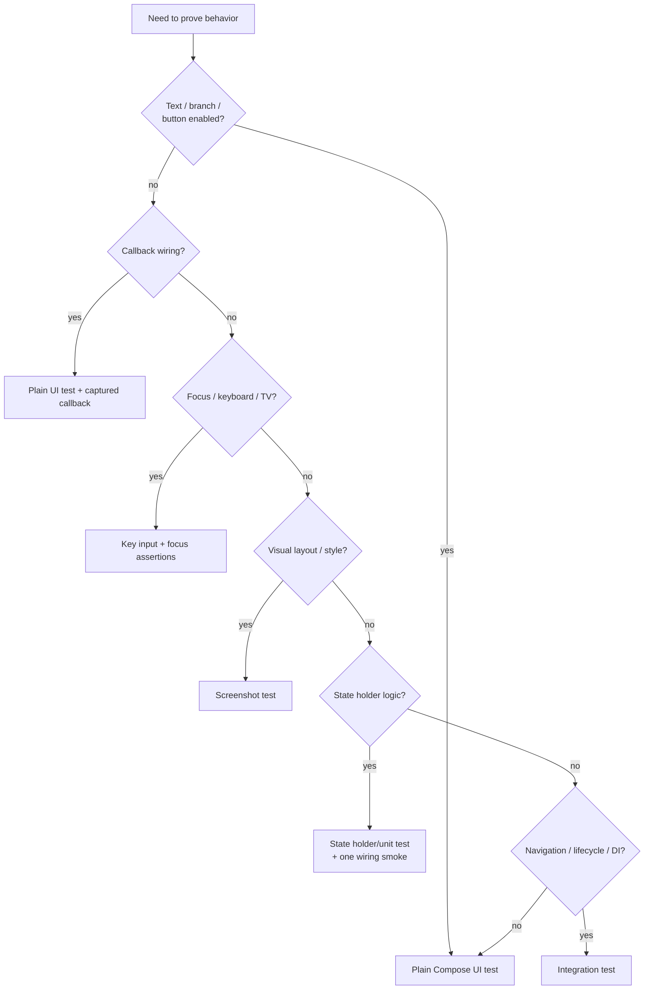

# Compose UI Testing Patterns 深度解析

对应 skill: [`compose-ui-testing-patterns`](../skills/compose-ui-testing-patterns/SKILL.md)

这一篇讲 Compose UI 测试策略：

> Test the smallest UI contract that proves the behavior.

不要为了测试一个 error row 构造完整 app graph，也不要用 screenshot 测简单文本存在。测试形状应该和要证明的 contract 匹配。

## 测试类型决策



## 优先测试 plain UI composable

如果 screen 已经按 state-holder/UI split 拆分：

```kotlin
@Composable
fun ProfileScreen(
    state: ProfileUiState,
    onNameChange: (String) -> Unit,
    onSaveClick: () -> Unit,
    onBackClick: () -> Unit,
)
```

测试它，不要先构造 ViewModel / repository / navigation。

```kotlin
var saved = false

composeTestRule.setContent {
    ProfileScreen(
        state = ProfileUiState(name = "Ada", canSave = true),
        onNameChange = {},
        onSaveClick = { saved = true },
        onBackClick = {},
    )
}

composeTestRule.onNodeWithText("Ada").assertIsDisplayed()
composeTestRule.onNodeWithText("Save").performClick()

assertThat(saved).isTrue()
```

这样测试的是 UI contract：

- state 渲染是否正确；
- button 是否存在；
- click 是否调用 callback。

不需要 app graph。

## Semantics first

语义行为用 semantics 断言：

- 文本存在：`onNodeWithText`
- content description：`onNodeWithContentDescription`
- enabled / disabled：`assertIsEnabled` / `assertIsNotEnabled`
- selected：`assertIsSelected`
- focused：`assertIsFocused`
- toggle：相关 semantics matcher
- 不存在：`assertDoesNotExist`

Test tag 是 fallback：

- 没有稳定可见文本；
- 多个节点文本相同；
- 节点本身不是用户可见语义；
- 需要定位容器。

不要默认给所有节点加 test tag。用户可见语义通常更强。

## Callback 测试

用 captured values：

```kotlin
var selectedId: ItemId? = null

composeTestRule.setContent {
    ItemList(
        items = listOf(ItemUi(id = ItemId("movie-1"), title = "Movie")),
        onItemClick = { selectedId = it },
    )
}

composeTestRule.onNodeWithText("Movie").performClick()

assertThat(selectedId).isEqualTo(ItemId("movie-1"))
```

如果 callback 后需要等待 Compose 应用 snapshot / recomposition，再用：

```kotlin
composeTestRule.runOnIdle {
    assertThat(value).isEqualTo(expected)
}
```

不要为了验证 callback 调用而 mock ViewModel。UI composable 的 contract 是“调用这个 lambda”，不是“调用某个 ViewModel 方法”。

## Interaction state 测试

hover、pressed、focused、dragged 这类 interaction state 不要靠鼠标/触摸模拟硬触发。更稳定的方式是注入 `MutableInteractionSource`。

```kotlin
val interactionSource = MutableInteractionSource()

composeTestRule.setContent {
    OutlinedButton(
        onClick = {},
        interactionSource = interactionSource,
    ) {
        Text("OutlinedButton")
    }
}

TestScope().launch {
    interactionSource.emit(HoverInteraction.Enter())
}

composeTestRule.waitForIdle()

composeTestRule.onNodeWithText("OutlinedButton").assertIsDisplayed()
```

适用：

- `HoverInteraction.Enter` / `Exit`
- `PressInteraction.Press` / `Release` / `Cancel`
- `FocusInteraction.Focus` / `Unfocus`
- `DragInteraction.Start` / `Stop` / `Cancel`

要点：

- production composable 要允许注入 interactionSource。
- test 中 emit interaction。
- assert 结果，不 assert interaction source 本身。
- screenshot test 也可以先 emit interaction，再截图。

## Keyboard / focus 测试

TV、desktop、keyboard-first UI 应用 key input 驱动：

```kotlin
composeTestRule.onNodeWithTag("screen").performKeyInput {
    pressKey(Key.DirectionDown)
}

composeTestRule.onNodeWithTag("play-button").assertIsFocused()
```

不要只用 `performClick()` 来证明焦点行为。

Focus ownership 用 semantics 断言；focus ring 外观用 screenshot。

详见：

[compose-focus-navigation.md](./compose-focus-navigation.md)

## Screenshot tests

截图适合证明 semantics 不能证明的视觉 contract：

- spacing / alignment；
- typography；
- color；
- elevation / shadow；
- clipping；
- image composition；
- gradient / overlay；
- focus ring；
- loading skeleton。

截图测试必须 deterministic：

- 固定 state data。
- 控制字体、locale、theme。
- freeze clock / animation progress。
- fake image loader。
- 不依赖真实网络。
- 不展示当前时间，除非注入固定时间。

不要用 screenshot 测简单文本存在；那是 semantics test。

## Fake images 与平台服务

如果图片内容不是被测重点：

- fake image loader；
- assert requested model；
- 返回 deterministic error/placeholder painter。

如果图片外观是被测重点：

- 使用本地 deterministic painter/bitmap；
- 不访问网络；
- 不依赖远端尺寸。

平台服务同理：permission、clipboard、share sheet、navigator 等应通过 fake boundary 控制。

## State holder 测试

State holder 逻辑优先用 unit test：

```kotlin
@Test
fun saveDisabledWhenNameBlank() = runTest {
    val stateHolder = ProfileStateHolder(...)
    stateHolder.onNameChange("")
    assertThat(stateHolder.state.value.canSave).isFalse()
}
```

UI 测试只补一个 wiring smoke：

- collect state；
- render screen；
- callback 能通到 state holder；
- 不重复测所有 business branches。

## 常见错误

1. 为测试 error row 构造完整 DI graph。
2. 用 ViewModel mock 验证 button click，而不是捕获 callback。
3. 用 screenshot 测简单文本。
4. 用 semantics 测 padding / color。
5. test tag 滥用。
6. 依赖真实图片、网络、系统时间。
7. hover / press 状态靠 `performMouseInput` 硬模拟。
8. TV UI 只测 click，不测 key navigation。

## 专家级审查清单

1. 测试是否证明最小 contract？
2. 是否能测试 plain UI composable，而不是 full app graph？
3. 断言是否优先使用用户可见 semantics？
4. callback 是否用 captured value 验证？
5. screenshot 是否只用于视觉 contract？
6. 动态资源是否 fake / freeze？
7. interaction state 是否通过 injected `MutableInteractionSource` 驱动？
8. keyboard/TV 是否通过 key input 测？
9. state holder 逻辑是否用 unit test，而不是 UI test 扛全部？

## 精髓总结

1. 测最小 UI contract。
2. Plain state-driven UI 优先，integration 只测 integration。
3. 语义行为用 semantics，视觉 contract 用 screenshot。
4. Interaction state 注入 `MutableInteractionSource`。
5. Focus/keyboard 用真实 key input 模型测试。
